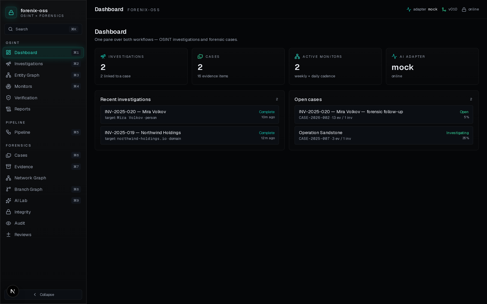
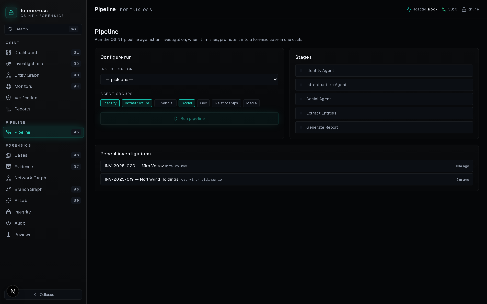
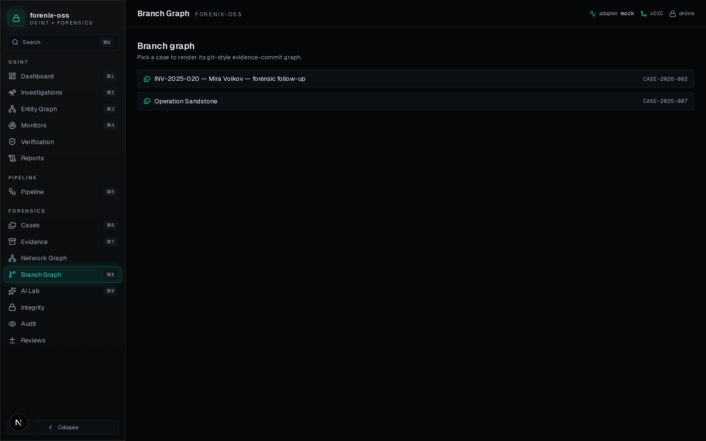
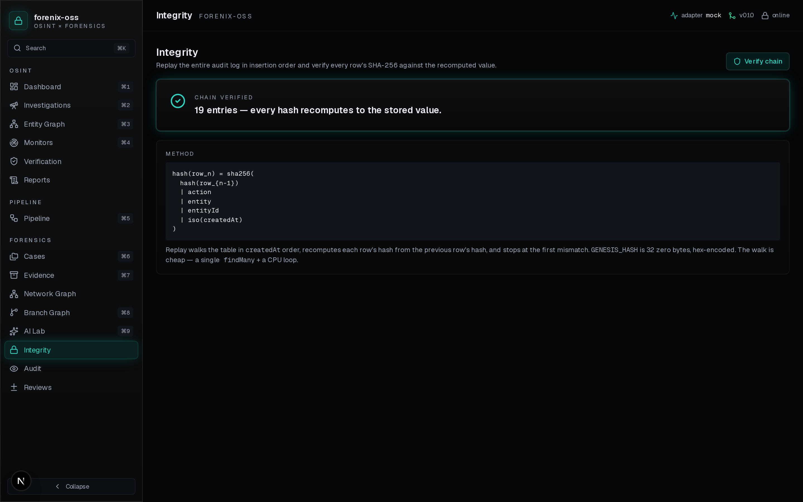

```
   __                              _              _________ ___
  / _|                            (_)            / / __ ___|/ __|
 | |_ ___  _ __ ___ _ __ ___  __  ___  __ _    / / / / ___ \__ \
 |  _/ _ \| '__/ _ \ '_ \ | \/ / | |/ _` |  / / / / (_)   ||__/
 | || (_) | | |  __/ | | || |\ /  | | (_| | / / /   \___/ ||
 |_| \___/|_|  \___|_| |_|\_/\/   |_|\__,_|/_/_/      OSS  ||
                                                            \\
```

# forenix-oss

[](https://github.com/thunderstornX/forenix-oss/actions/workflows/ci.yml)
[](LICENSE)
[](CHANGELOG.md)
[](https://forenix-oss.vercel.app)

**OSINT × Forensics, one workflow.**

Open-source platform that turns public-source intelligence into
court-admissible evidence — with a cryptographic chain of custody
from the first finding to the final verdict.

### 👉 Try it live: <https://forenix-oss.vercel.app>

Demo accounts (password `forenix` for all three):
- `admin@forenix-oss.local` — full access, manage users + teams
- `investigator@forenix-oss.local` — runs pipelines, manages cases
- `analyst@forenix-oss.local` — scoped reads + verify findings

The live demo is backed by Neon Postgres + the Groq LPU adapter
(real LLM, ~5 s pipeline runs). Audit chain verifies cleanly on
every page load.



> The shipping ground truth: one schema, two workflows, seven AI
> adapters, every state change on a SHA-256 forward chain.

---

## Why

OSINT analysts and forensic examiners run on two disconnected
toolchains today — Maltego / SpiderFoot / Hunchly on one side,
EnCase / AXIOM / Cellebrite on the other. The handoff is manual,
the chain of custody is artisanal, and the audit trail rarely
survives a court challenge. forenix-oss owns both halves in one
MIT-licensed app.

## The headline feature

**Pipeline → Bridge → Chain.** Run an AI-driven OSINT pipeline,
promote any finding into a forensic Evidence row in one click, and
let the SHA-256 forward chain attest every state change.





---

## Quick start

```bash
bun install
cp .env.example .env
bun run db:push
bun run db:seed
bun run dev
```

Open <http://localhost:3000>. Walk through the
[demo script](docs/DEMO_SCRIPT.md) to see every feature.

To swap the mock adapter for a real LLM:

```env
AI_ADAPTER=nvidia            # or openrouter / ollama / glm / claude
NVIDIA_API_KEY=nvapi-…
NVIDIA_MODEL=meta/llama-3.3-70b-instruct
```

Per-call adapter overrides are supported via the request body:

```bash
curl -X POST -H "content-type: application/json" \
  -d '{"agentGroups":["identity","social"],"adapter":"openrouter"}' \
  http://localhost:3000/api/pipeline/run/<INVESTIGATION_ID>
```

---

## What's in the box

15 production views, 23 API routes, 6 AI adapters, one merged
Prisma schema, one cryptographically-attested audit log.

| View | Problem it solves |
|---|---|
| **[Dashboard](docs/screenshots/01-dashboard.png)** | Both workflows on one screen |
| **[Investigations](docs/screenshots/02-investigations.png)** | OSINT collection workspace |
| **[Pipeline](docs/screenshots/03-pipeline.png)** | Run + bridge in one click |
| **[Cases](docs/screenshots/04-cases.png)** | Forensic case manager |
| **[Evidence](docs/screenshots/05-evidence.png)** | Inventory + chain of custody |
| **[Branch graph](docs/screenshots/06-branch-graph.png)** | Git-style commit history over evidence |
| **[Entity graph](docs/screenshots/07-entity-graph.png)** | OSINT entity + relation map |
| **[Network graph](docs/screenshots/08-network-graph.png)** | Cross-case knowledge graph |
| **[Monitors](docs/screenshots/09-monitors.png)** | Cadenced re-runs |
| **[Verification](docs/screenshots/10-verification.png)** | Claim-level verdicts |
| **[AI Lab](docs/screenshots/11-ai-lab.png)** | Visibility into every agent run |
| **[Reports](docs/screenshots/12-reports.png)** | Sectioned JSON + markdown |
| **[Audit](docs/screenshots/13-audit.png)** | Full hash-chained log |
| **[Integrity](docs/screenshots/14-integrity.png)** | One-button chain verification |
| **[Reviews](docs/screenshots/15-reviews.png)** | Merge-request review on evidence branches |

Detailed walkthrough with screenshots + what each view does **not**
claim: [`docs/FEATURES.md`](docs/FEATURES.md).

---

## AI adapters

| Adapter | Cost | Status | Live tested |
|---|---|---|---|
| `mock` | free | ✅ shipped — deterministic seeded output | ✅ |
| `ollama` | free | stub (drop-in) | — |
| `glm` | free tier | stub (drop-in) | — |
| `claude` | paid (SaaS-gated) | stub | — |
| `openrouter` | free + paid | ✅ shipped | ✅ |
| `nvidia` | free dev tier + paid | ✅ shipped | ✅ |
| `groq` | **free, no card** · ~150ms latency | ✅ shipped | ✅ |

Live demos this build proved out (target: `INV-2025-020 — Mira
Volkov`):

- **Groq `llama-3.3-70b-versatile`** — **4.2 s**, 11 findings,
  1 entity, chain green at 16 entries. (Fastest of the bunch by
  more than 10×.)
- **NVIDIA `meta/llama-3.3-70b-instruct`** — 47s, 11 findings,
  5 entities, 7 relations, chain green.
- **OpenRouter `openai/gpt-oss-120b:free`** — 82s, 10 findings,
  9 entities, 8 relations → bridged to case → 13 evidence rows
  promoted, chain green at 19 entries.

Adding a 7th provider is a single file — see
[`src/lib/ai/adapters/`](src/lib/ai/adapters/) for the shape.

---

## Audit chain

Every audit row carries:

```
hash = sha256( prevHash | action | entity | entityId | iso(createdAt) )
```

`verifyAuditChain()` replays the entire log in insertion order and
breaks loudly on tampering. The cryptographic method is documented
+ reproducible offline:

```python
import csv, hashlib
GENESIS = "0" * 64
prev = GENESIS
for r in csv.DictReader(open("audit.csv")):
    h = hashlib.sha256("|".join([
        prev, r["action"], r["entity"], r["entityId"] or "",
        r["createdAt"]
    ]).encode("utf-8")).hexdigest()
    assert r["prevHash"] == prev and r["hash"] == h, f"BROKEN at {r['id']}"
    prev = r["hash"]
print("chain OK")
```

Full security posture + threat model: [`docs/07-SECURITY.md`](docs/07-SECURITY.md).

---

## Document pack

For investors, design partners, engineers, and auditors:

- [BRD — Business Requirements](docs/01-BRD.md)
- [SRS — Software Requirements](docs/02-SRS.md)
- [SDS — Software Design](docs/03-SDS.md)
- [DFD — Data Flow Diagrams](docs/04-DFD.md)
- [Deployment Plan](docs/05-DEPLOYMENT.md)
- [Architecture ADRs](docs/06-ARCHITECTURE.md)
- [Security + Threat Model](docs/07-SECURITY.md)
- [API Reference](docs/08-API.md)
- [Operational Runbook](docs/09-RUNBOOK.md)
- [Feature Catalogue](docs/FEATURES.md) (with screenshots)
- [One-pager](docs/ONE_PAGER.md)
- [Demo Script](docs/DEMO_SCRIPT.md)
- **[User Manual (PDF)](docs/USER_MANUAL.pdf)** — 42 pages, every view with screenshots ·
  [markdown source](docs/USER_MANUAL.md)
- **[How-To Guide (PDF)](docs/HOW_TO.pdf)** — task-oriented recipes ("How to create an investigation", "How to verify the chain", …) ·
  [markdown source](docs/HOW_TO.md)
- **[YC Pitch Deck (PDF)](docs/pitch/forenix-oss-yc-deck.pdf)** ·
  [editable .pptx](docs/pitch/forenix-oss-yc-deck.pptx)

---

## Stack

Next.js 16 (App Router, Turbopack) · TypeScript strict · Tailwind 4 ·
Prisma 6 (SQLite for dev, Postgres for prod) · Zustand + persist ·
TanStack Query 5 · lucide-react · sonner · Bun as runtime.

---

## Repository layout

```
src/
  app/
    api/                 # 23 route handlers (health, investigations,
                         # pipeline, bridge, findings, cases, evidence,
                         # audit, network, …)
    layout.tsx
    page.tsx             # SPA shell + ?view= deep-link support
    globals.css          # design tokens + .glass utilities
  components/
    command-palette.tsx  # ⌘K palette
    filter-input.tsx
    layout/              # sidebar, topbar
    views/               # one file per top-level view
  lib/
    ai/
      types.ts           # wire contract
      adapter.ts         # factory
      chat-completions.ts# shared OpenAI-compat helpers
      adapters/          # mock, ollama, glm, claude, openrouter, nvidia
    audit.ts             # server-only — appendAudit + verifyAuditChain
    audit-chain.ts       # pure SHA-256 helpers
    db.ts                # PrismaClient singleton
    hooks.ts             # TanStack Query hooks
    store.ts             # Zustand UI store + NAV registry
    utils.ts
prisma/
  schema.prisma          # merged Argus + ForenX (19 models, 2 bridges)
  seed.ts                # demo seed with valid hash-chained audit log
scripts/
  screenshots.mjs        # capture every view via Playwright
  gen_pitch_deck.py      # build the YC .pptx + .pdf
docs/
  01-BRD.md … 09-RUNBOOK.md
  FEATURES.md
  ONE_PAGER.md
  DEMO_SCRIPT.md
  screenshots/           # 19 PNGs covering every view
  pitch/                 # YC deck (pptx + pdf)
```

---

## Stack of stacks (open core / SaaS split)

| Tier | Distribution | Includes |
|---|---|---|
| **Core (MIT)** | self-host / Docker / `bun run` | every analyst feature, 5 of 6 adapters, hash-chain audit, branch-graph, integrity verifier |
| **Team** (planned) | hosted single-tenant | managed Postgres + backups + dashboards + Sentry + monitors + email support |
| **SaaS Premium** (planned) | hosted multi-tenant | Claude adapter, advanced OSINT sources, PDF export, org isolation, SSO, usage metering |
| **Enterprise** (planned) | air-gapped / annual | custom adapters, in-jurisdiction hosting, SOC2 attestation |

`SAAS_MODE=true` is the **only** premium gate — core paths run
identically whether it's set or not.

---

## Roadmap

- ✅ Phase 1 — Foundation: adapter, schema, seed, shell, 3 API routes
- ✅ Phase 2 — Investigation + Case detail with full CRUD + analyst actions
- ✅ Phase 3 — Pipeline runner + bridge + 6 AI adapters
- ✅ Phase 4 — Evidence chain-of-custody UI + Integrity Dashboard
- ✅ Phase 5 — Unified entity / network graph
- ✅ Phase 6 — AI Lab, Monitors, Verification
- ✅ Phase 7 — Report viewer + live OpenRouter + NVIDIA adapters
- Phase 8 — Docker Compose · file-byte evidence storage · scheduled Monitors · multi-tenant orgs · ClaudeAdapter · PDF export

---

## License

MIT. Built by [Ali Murtaza Bhutto](https://github.com/thunderstornX)
(`alibhutto101112@gmail.com`).
