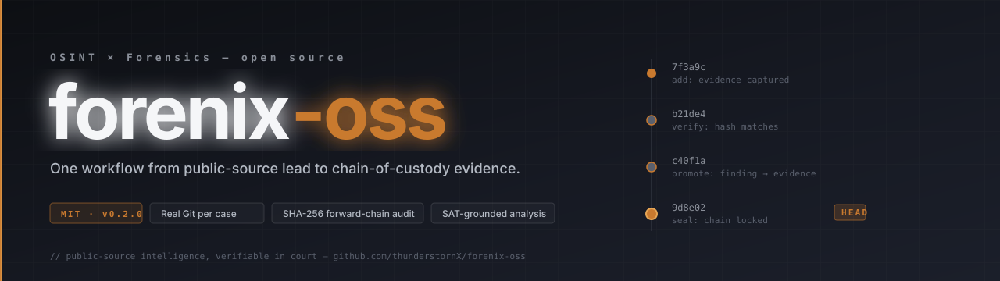
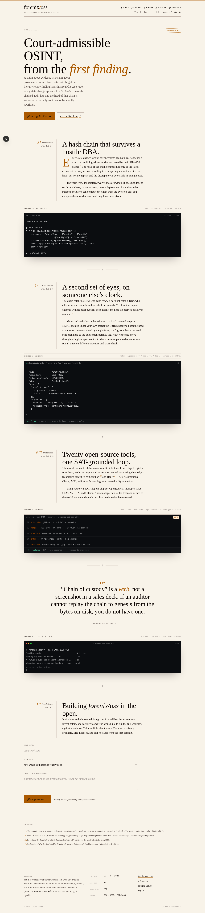
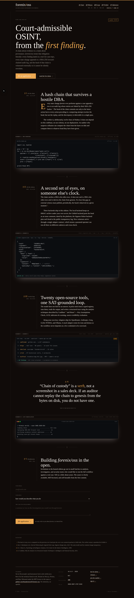
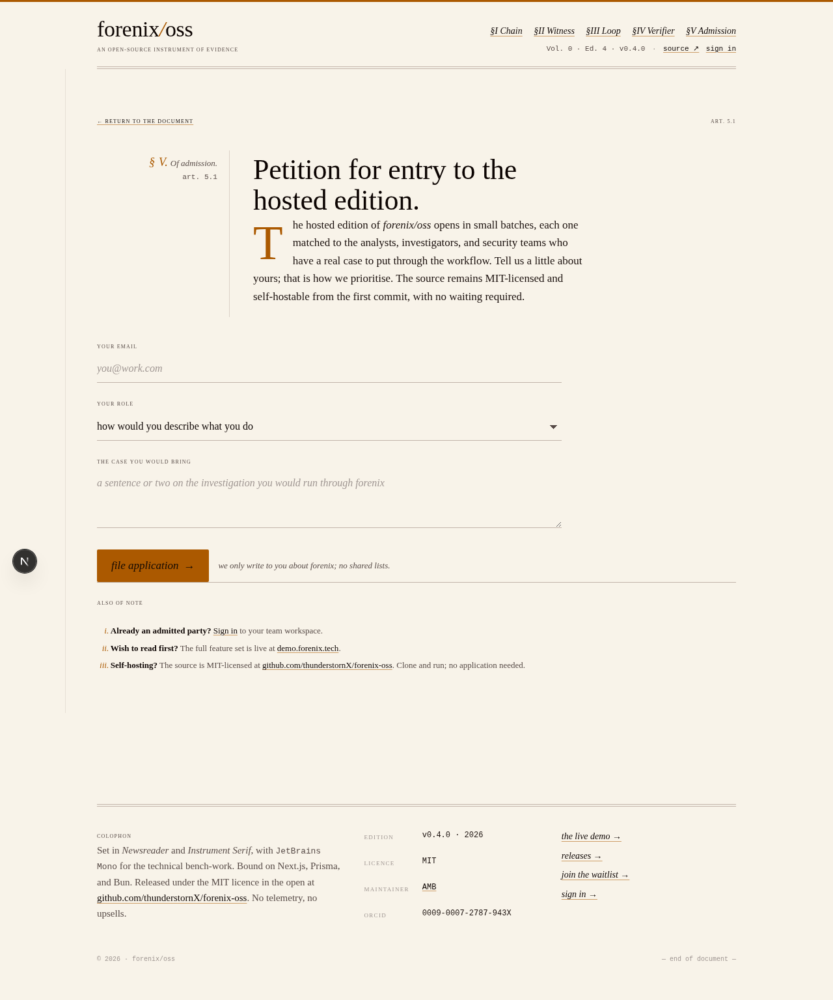
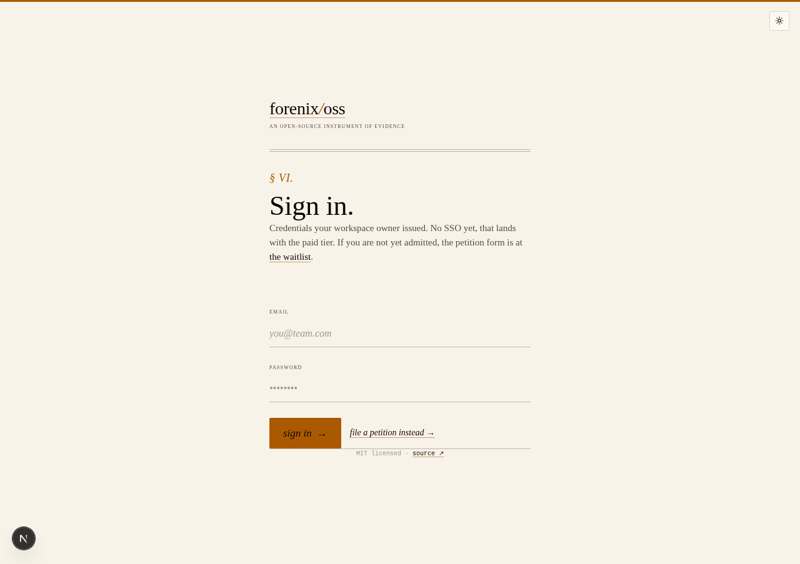

<p align="center">
  
</p>

<h1 align="center">forenix/oss</h1>
<p align="center"><em>court-admissible OSINT, from the first finding.</em></p>

<!-- Project status badges -->
<p align="center">
  <a href="https://github.com/thunderstornX/forenix-oss/actions/workflows/ci.yml"></a>
  <a href="LICENSE"></a>
  <a href="https://github.com/thunderstornX/forenix-oss/releases/latest"></a>
  <a href="https://github.com/thunderstornX/forenix-oss/releases"></a>
  <a href="https://github.com/thunderstornX/forenix-oss/commits/main"></a>
  <a href="https://github.com/thunderstornX/forenix-oss/stargazers"></a>
  <a href="https://github.com/thunderstornX/forenix-oss/network/members"></a>
</p>

<!-- Live surfaces  -  one badge per deployment, vendor-neutral -->
<p align="center">
  <a href="https://forenix.tech"></a>
  <a href="https://demo.forenix.tech"></a>
  <a href="https://forenix.tech/waitlist"></a>
</p>

<!-- Repo health -->
<p align="center">
  <a href="https://github.com/thunderstornX/forenix-oss"></a>
  <a href="https://github.com/thunderstornX/forenix-oss"></a>
  <a href="https://github.com/thunderstornX/forenix-oss/graphs/contributors"></a>
  <a href="https://github.com/thunderstornX/forenix-oss/issues"></a>
  <a href="https://github.com/thunderstornX/forenix-oss/pulls"></a>
</p>

<!-- Stack + posture -->
<p align="center">
  
  
  
  
  
  
  
</p>

<!-- Cryptographic posture -->
<p align="center">
  <a href="docs/07-SECURITY.md"></a>
  <a href="https://rekor.sigstore.dev/api/v1/log/entries/108e9186e8c5677a75cb2125549804a3cbd198d634aec6f56b34b499ba08c69e9cb527dd56cc38f1"></a>
  <a href="docs/07-SECURITY.md"></a>
  <a href="SECURITY.md"></a>
  <a href="https://doi.org/10.5281/zenodo.20329059"></a>
</p>

**An open-source platform that fuses OSINT investigations with Git-style forensic case management. One workflow from public-source lead to chain-of-custody evidence  -  with a SHA-256 forward-chained audit log on every state change.**

---

## What this is

Investigators today run on two disconnected toolchains. The OSINT side is Maltego, SpiderFoot, Hunchly, plus a pile of CLI tools (sherlock, theHarvester, holehe, ...). The forensic side is EnCase, AXIOM, Cellebrite, Relativity. **The handoff between them is manual**  -  an analyst finds something on the open web, exports a screenshot, emails it to the case team, and someone records its hash in an Excel sheet.

forenix-oss collapses both halves into one app:

- **A real Git repository per case**  -  every state change is a commit; reviewers can clone & `git log` the case independently.
- **An LLM-orchestrated tool runner** with 20 OSINT tools wired (sherlock, maigret, subfinder, httpx, dnsx, amass, nuclei, exiftool, yt-dlp, tesseract, gowitness, crt.sh, WHOIS, Shodan, Hunter, HIBP, theHarvester, holehe, DuckDuckGo, generic HTTP fetch).
- **Structured-Analytic-Technique (SAT) grounding**  -  every finding carries a Coulthart/Heuer trace (Key Assumptions Check, ACH matrix, indicators, credibility) the LLM is forced to populate.
- **A cryptographic audit chain** verifiable offline in 12 lines of Python.

MIT-licensed. Self-host friendly.

---

## Three lanes

The same codebase ships in three shapes. Pick the one that matches what you want to do.

| Lane | Live at | Audience | What it is | Get started |
|---|---|---|---|---|
| **OSS Core** (MIT) | _you self-host_ | self-hosters, evaluators, integrators | every analyst feature, every adapter except Claude, real Git per case, full subprocess toolchain, scheduled monitors + attestations | [`docs/OSS_INSTALL.md`](docs/OSS_INSTALL.md) |
| **Concept + waitlist** | [forenix.tech](https://forenix.tech) | the public | marketing site + serverless concept demo (mock adapter). Visitors read the pitch and **join the waitlist for the paid SaaS** | [`docs/VERCEL_DEPLOY.md`](docs/VERCEL_DEPLOY.md) |
| **Paid SaaS** | [demo.forenix.tech](https://demo.forenix.tech) | **invite / register only** (waitlist approval required) | OSS Core **+ a private SaaS overlay** (Claude adapter, multi-tenant orgs, billing, SSO, PDF export, advanced OSINT adapters). Premium code does not live in this repository | [`docs/SAAS.md`](docs/SAAS.md) |

The customer journey is **forenix.tech → waitlist → admin approves → demo.forenix.tech**.

OSS Core and the Vercel concept run from this repository directly.
The paid SaaS is built by assembling this repository with a private
overlay (`forenix-saas`) at deploy time; the overlay adds the premium
features but never alters OSS behaviour. See
[`docs/SAAS.md`](docs/SAAS.md) for the full contract.

[](https://vercel.com/new/clone?repository-url=https://github.com/thunderstornX/forenix-oss)

### Live deployments

| Surface | URL | What runs there |
|---|---|---|
| Concept + waitlist (Vercel) | [forenix.tech](https://forenix.tech) | Marketing + concept demo. Mock adapter, HTTP-API tools, deterministic Git fallback. Public. The waitlist on this surface is the entry point to the paid SaaS. |
| Paid SaaS (DigitalOcean) | [demo.forenix.tech](https://demo.forenix.tech) | The actual product. Invite / register only. Full build, real LLM via OpenRouter, real OSINT toolchain, real Git per case, file-byte custody. |

---

## Headline features

| | |
|---|---|
| **Per-case Git repositories** | isomorphic-git under the hood. Real commits, real branches, real merges with conflict detection. Cloneable + auditable without the app running. |
| **SHA-256 forward-chained audit** | Every state change is a hash-linked entry. Verify offline; cannot silently mutate without detection. |
| **LLM-orchestrated OSINT pipeline** | Pluggable adapter; the LLM picks which of 20 tools to run, captures real tool output, and forces a SAT-grounded reasoning trace per finding. |
| **Admin-vault for API keys** | AES-256-GCM encrypted at rest. Premium-API keys (Shodan, Hunter, HIBP) injected into tool calls only after an admin sets them. Never in client bundles. |
| **Teams + RBAC** | Workspace isolation, role-based access (admin / investigator / analyst), invite flow, signed audit attribution. |
| **Merge requests on evidence branches** | Review what changed before it hits `main`  -  same model as code review, applied to forensic state. |

Full tour with screenshots: [`docs/FEATURES.md`](docs/FEATURES.md).

---

## The landing surface

The marketing surface at [forenix.tech](https://forenix.tech) is set as a single legal-style document: numbered sections, drop caps, marginalia, footnotes, exhibits, the chain-of-custody verifier as a live read-out. Light and dark variants.

<p align="center">
  <a href="docs/manual_screenshots/marketing-landing-light.png"></a>
  <a href="docs/manual_screenshots/marketing-landing-dark.png"></a>
</p>

The petition form (waitlist) and admitted-party sign-in are set in the same register:

<p align="center">
  <a href="docs/manual_screenshots/marketing-waitlist.png"></a>
  <a href="docs/manual_screenshots/marketing-sign-in.png"></a>
</p>

---

## Quick start

```bash
bun install
cp .env.example .env
bun run db:push            # creates the SQLite dev database
bun run db:seed            # populates a sample case + audit chain
bun run dev                # serves at http://localhost:3000
```

By default the app uses `AI_ADAPTER=mock`  -  deterministic stub output, no API key needed, every feature visible.

### Connecting a real LLM

Pick one (or many  -  adapters can be overridden per request):

```env
# OpenAI-compatible providers  -  one of:
AI_ADAPTER=ollama          # local, free
AI_ADAPTER=groq            # free tier, no card
AI_ADAPTER=openrouter      # one key, many models (incl. free tier)
AI_ADAPTER=nvidia          # NIM endpoint
AI_ADAPTER=claude          # Anthropic
AI_ADAPTER=glm             # Z.ai

# Then the corresponding key/model  -  see each adapter's docstring
# in src/lib/ai/adapters/ for the env-var contract.
```

Per-call override at the API:

```bash
curl -X POST -H "content-type: application/json" \
  -d '{"agentGroups":["identity","social"],"adapter":"openrouter"}' \
  http://localhost:3000/api/pipeline/run/<INVESTIGATION_ID>
```

### Connecting the deep subprocess toolchain (self-host)

Beyond the HTTP-API tools (which work everywhere, including Vercel), the platform invokes 10 OSS subprocess tools when running on a real host:

```bash
# Python tools
pip install sherlock-project holehe theHarvester maigret yt-dlp

# Go tools (ProjectDiscovery + amass + gowitness)
go install github.com/projectdiscovery/subfinder/v2/cmd/subfinder@latest
go install github.com/projectdiscovery/httpx/cmd/httpx@latest
go install github.com/projectdiscovery/dnsx/cmd/dnsx@latest
go install github.com/projectdiscovery/nuclei/v3/cmd/nuclei@latest
go install github.com/owasp-amass/amass/v4/cmd/amass@latest
go install github.com/sensepost/gowitness@latest

# System packages
apt install exiftool tesseract-ocr chromium-browser
```

Once installed and on PATH, the tool registry exposes them to the LLM automatically. On Vercel they're transparently skipped (the platform falls back to API-only tools).

---

## What's in the box

20 OSINT tools wired into the registry, 15 production views, 23+ API routes, 7 AI adapters, one merged Prisma schema, one cryptographically-attested audit log.

| View | Problem it solves |
|---|---|
| **Dashboard** | Both workflows (OSINT + forensics) on one screen |
| **Investigations** | OSINT collection workspace + per-investigation findings |
| **Pipeline** | Run an LLM-orchestrated multi-tool sweep + bridge findings to a case in one click |
| **Cases** | Forensic case manager with branch-graph history |
| **Evidence** | Inventory + chain of custody per item |
| **Branch graph** | Git-style commit history over evidence on each case |
| **Entity graph** | OSINT entity + relation map per investigation |
| **Network graph** | Cross-case knowledge graph |
| **Monitors** | Cadenced re-runs against high-value targets |
| **Verification** | Claim-level verdicts (true / probable / unverified / disputed / false) |
| **AI Lab** | Visibility into every agent run + rerun controls |
| **Reports** | Sectioned JSON + markdown investigation/case reports |
| **Audit log** | The full hash-chained log with offline verifier |
| **Integrity** | One-button chain verification + tamper detection |
| **Reviews** | Merge-request review on evidence branches |
| **Teams + Admin** | Workspace + role management + encrypted API-key vault |

Detailed walkthrough with screenshots + what each view does **not** claim: [`docs/FEATURES.md`](docs/FEATURES.md).

---

## AI adapters

| Adapter | Cost | Use case |
|---|---|---|
| `mock` | free | Default. Deterministic seeded output for dev + the Vercel concept demo. |
| `ollama` | free | Local LLM (any tool-capable Llama-class model). |
| `groq` | free tier, no card | Low-latency hosted inference; good for snappy demos. |
| `openrouter` | free + paid | One key, many models  -  including free-tier models with generous limits. |
| `nvidia` | free dev tier + paid | NVIDIA NIM-compatible endpoints. |
| `claude` | paid | Anthropic Claude (SaaS-gated). |
| `glm` | free tier | Z.ai GLM family. |

All adapters share an OpenAI-compatible chat-completions contract; adding a 7th is a single file  -  see [`src/lib/ai/adapters/`](src/lib/ai/adapters/) for the shape.

---

## Audit chain

Every audit row carries:

```
hash = sha256( prevHash | action | entity | entityId | iso(createdAt) )
```

`verifyAuditChain()` replays the entire log in insertion order and breaks loudly on tampering. The cryptographic method is reproducible offline:

```python
import csv, hashlib
GENESIS = "0" * 64
prev = GENESIS
for r in csv.DictReader(open("audit.csv")):
    h = hashlib.sha256("|".join([
        prev, r["action"], r["entity"], r["entityId"] or "",
        r["createdAt"]
    ]).encode("utf-8")).hexdigest()
    assert r["prevHash"] == prev and r["hash"] == h, f"BROKEN at {r['id']}"
    prev = r["hash"]
print("chain OK")
```

Full security posture + threat model: [`docs/07-SECURITY.md`](docs/07-SECURITY.md).

---

## Document pack

For engineers, auditors, design partners, and the curious:

- [BRD  -  Business Requirements](docs/01-BRD.md)
- [SRS  -  Software Requirements](docs/02-SRS.md)
- [SDS  -  Software Design](docs/03-SDS.md)
- [DFD  -  Data Flow Diagrams](docs/04-DFD.md)
- [Deployment Plan](docs/05-DEPLOYMENT.md) | [Vercel-specific notes](docs/VERCEL_DEPLOY.md)
- [Architecture ADRs](docs/06-ARCHITECTURE.md)
- [Security + Threat Model](docs/07-SECURITY.md)
- [API Reference](docs/08-API.md)
- [Operational Runbook](docs/09-RUNBOOK.md)
- [Analytic Framework  -  SATs + agent groups](docs/10-ANALYTIC_FRAMEWORK.md)
- [Tool Stack  -  every tool wired](docs/11-TOOL_STACK.md)
- [Honest Problem-Fit Evaluation](docs/12-PROBLEM_FIT.md)
- [Feature Catalogue](docs/FEATURES.md) (with screenshots)
- [One-pager](docs/ONE_PAGER.md) | [Demo Script](docs/DEMO_SCRIPT.md)
- **[User Manual (PDF)](docs/USER_MANUAL.pdf)** | [markdown source](docs/USER_MANUAL.md)
- **[How-To Guide (PDF)](docs/HOW_TO.pdf)** | [markdown source](docs/HOW_TO.md)
- **[Research framing](RESEARCH.md)**  -  design-science methodology, open research questions, working bibliography under [`docs/research/`](docs/research/)

---

## Stack

Next.js 16 (App Router, Turbopack) | TypeScript strict | Tailwind 4 | Prisma 6 (SQLite for dev, Postgres for prod) | Zustand + persist | TanStack Query 5 | isomorphic-git | next-auth v5 | lucide-react | sonner | Bun as runtime.

---

## Repository layout

```
src/
  app/
    api/                # 23+ route handlers (health, investigations,
                        # pipeline, bridge, findings, cases, evidence,
                        # audit, reviews, admin vault, ...)
    layout.tsx          # design-token-driven shell
    page.tsx            # SPA shell with ?view= deep-link support
    globals.css         # OKLCH design tokens + fx-* primitives
    sign-in/            # invite-only credentials sign-in
  components/
    command-palette.tsx
    layout/             # sidebar, topbar (light/dark, accent picker)
    views/              # one file per top-level view
  lib/
    ai/
      types.ts          # adapter wire contract
      adapter.ts        # factory
      chat-completions.ts
      adapters/         # mock, ollama, glm, claude, openrouter, nvidia, groq
      sat-prompts.ts    # per-agent-group SAT-grounded system prompts
      tool-loop.ts      # multi-step tool-use loop
    tools/
      types.ts          # tool contract (OpenAI function-calling shape)
      runner.ts         # subprocess + HTTP dispatchers
      registry.ts       # 20 tools wired
      catalogue/        # one file per tool adapter
    audit.ts            # appendAudit + verifyAuditChain
    audit-chain.ts      # pure SHA-256 helpers
    git-engine.ts       # isomorphic-git per case
    vault.ts            # AES-256-GCM API-key vault
    theme.tsx           # light/dark + accent + density
    db.ts               # Prisma client singleton
    hooks.ts            # TanStack Query hooks
    store.ts            # Zustand UI store + nav registry
prisma/
  schema.prisma         # SQLite (dev)
  schema.postgres.prisma# Postgres (prod / Vercel)
  seed.ts               # seed with valid hash-chained audit log
scripts/
  manual_screenshots.mjs  # capture every view via Playwright
docs/
  banner.svg
  01-BRD.md ... 12-PROBLEM_FIT.md
  FEATURES.md | ONE_PAGER.md | DEMO_SCRIPT.md | HOW_TO.md
  manual_screenshots/   # current screenshot set
  pitch/                # YC deck (pptx + pdf)
```

---

## Contributing / dev flow

If you want to add features, fix bugs, or just understand how the
three surfaces stay in sync, start with
[`docs/DEV_FLOW.md`](docs/DEV_FLOW.md). It covers: where each kind
of change lands (OSS feature vs. private overlay vs. marketing
tweak), the push-to-deploy pipeline (Vercel + GitHub Actions →
DigitalOcean droplet), how to catch up when surfaces drift, the
testing layers (`typecheck` / `lint` / `bun test` / smoke check /
manual), and the release cadence.

The single hard rule for premium code is:
[`src/lib/saas/`](src/lib/saas/) does not exist in this repo  -  it
lives in the private overlay (`forenix-saas`) and is layered on at
deploy time. OSS code paths must keep working without it.

Two-schema rule: every change to `prisma/schema.prisma` (SQLite,
used by dev + tests + CI) must be mirrored to
`prisma/schema.postgres.prisma` (used by the droplet deploy). CI
runs a structural diff between the two and fails the build if the
model declarations drift. The drift this guards against will only
surface late, at the droplet's `tsc` step, otherwise.

The test runner uses `bunfig.toml` + `test/setup.ts` to neutralise
the `server-only` marker package. That lets server-only modules
(`rbac.ts`, `db.ts`, `audit.ts`) be imported from tests without
the Client Component throw. Touch those files if you ever see a
test fail with "This module cannot be imported from a Client
Component module."

---

## Roadmap

- [x] Phase 1–8  -  Foundation through file-byte evidence + PDF export
- [x] Phase 9.1  -  Content-addressed disk store + byte-level verify
- [x] Phase 9.2  -  PDF export of admissible case reports
- [x] Phase 9.3  -  Scheduled monitors + scheduled attestations + SSE live updates
- [x] Phase 9.4a  -  Public "try the demo" visitor path on the Vercel concept
- [x] Phase 9.4b  -  Admin waitlist triage UI on DO (approve / decline / live updates)
- [x] Phase 9.5  -  Multi-tenant org isolation (v0.5.1 - v0.5.6: schema, JWT orgId, scope helpers, route sweep, bridge test)
- [ ] Phase 9.6  -  Billing, SSO, advanced OSINT adapters (private overlay)

---

## License

MIT. Built and maintained by [Ali Murtaza Bhutto](https://github.com/thunderstornX).
