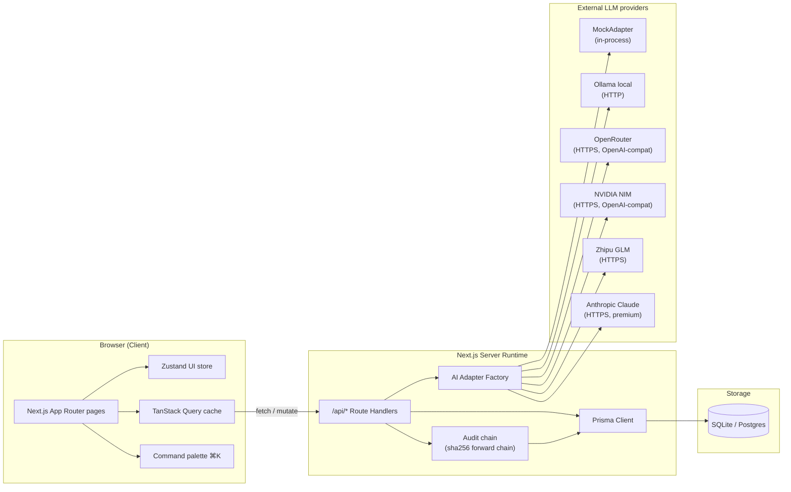
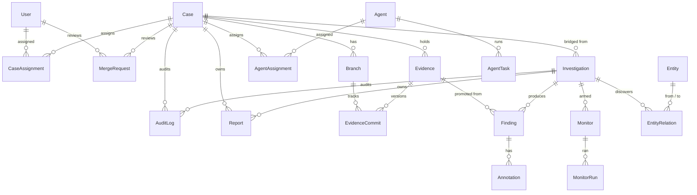
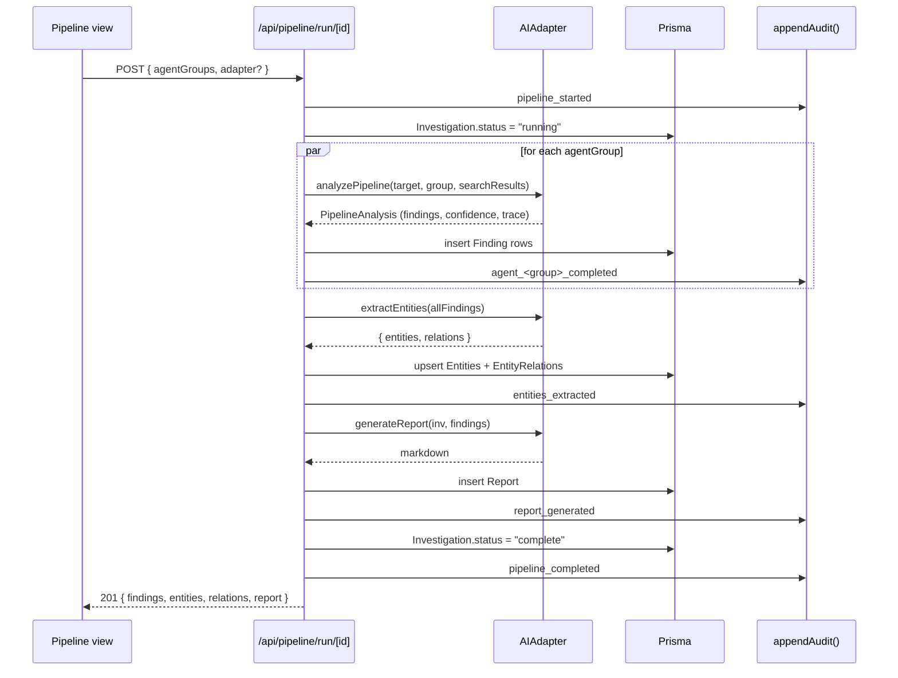

# Software Design Specification  -  forenix-oss

| Document | Software Design Specification (SDS) |
| Version | 0.1 |

## 1. Architectural overview



The architecture is intentionally thin:
- **One web app** (no microservice split in 0.1).
- **One Prisma client** (singleton, hot-reload safe).
- **One adapter factory** (no DI container; `getAdapter()` is a
  module-level cache).
- **One hash chain** (`appendAudit()` is the only legal way to write
  an audit row).

## 2. Layering + module boundaries

### 2.1 Module map

```
src/
├── app/                          # Next.js routes
│   ├── layout.tsx                # root layout + providers
│   ├── page.tsx                  # SPA shell + view router
│   └── api/                      # all server routes
│       ├── health/route.ts
│       ├── investigations/{,[id]}/route.ts
│       ├── pipeline/run/[id]/route.ts
│       ├── bridge/inv-to-case/[id]/route.ts
│       ├── findings/[id]/{verify,promote}/route.ts
│       ├── cases/{,[id]}/route.ts
│       ├── evidence/{,[id]/seal}/route.ts
│       ├── entities/route.ts
│       ├── monitors/route.ts
│       ├── verifications/route.ts
│       ├── agents/route.ts
│       ├── reports/{,[id]}/route.ts
│       ├── reviews/route.ts
│       ├── audit/{,verify}/route.ts
│       └── network/route.ts
│
├── components/
│   ├── command-palette.tsx       # ⌘K palette
│   ├── filter-input.tsx          # shared filter widget
│   ├── providers.tsx             # TanStack Query provider
│   ├── layout/{sidebar,topbar}.tsx
│   └── views/                    # one file per view
│       ├── view-shell.tsx        # common header
│       ├── dashboard.tsx
│       ├── investigations.tsx ── investigation-detail.tsx
│       ├── cases.tsx ─────────── case-detail.tsx
│       ├── pipeline.tsx
│       ├── evidence.tsx
│       ├── branch-graph.tsx
│       ├── entity-graph.tsx
│       ├── network-graph.tsx
│       ├── monitors.tsx
│       ├── verification.tsx
│       ├── ai-lab.tsx
│       ├── reports.tsx
│       ├── audit.tsx
│       ├── integrity.tsx
│       └── reviews.tsx
│
└── lib/
    ├── ai/
    │   ├── types.ts              # wire contract
    │   ├── adapter.ts            # factory + getAdapter()
    │   ├── chat-completions.ts   # shared OpenAI-compat helpers
    │   └── adapters/
    │       ├── mock.ts           # seeded deterministic
    │       ├── ollama.ts         # local Ollama (stub)
    │       ├── glm.ts            # Zhipu GLM (stub)
    │       ├── claude.ts         # Anthropic (stub, premium-gated)
    │       ├── openrouter.ts     # OpenRouter (live)
    │       └── nvidia.ts         # NVIDIA NIM (live)
    ├── audit.ts                  # server-only  -  appendAudit + verifyAuditChain
    ├── audit-chain.ts            # pure SHA-256 helpers (importable from seed)
    ├── db.ts                     # PrismaClient singleton
    ├── hooks.ts                  # TanStack Query hooks
    ├── store.ts                  # Zustand UI store + NAV registry
    └── utils.ts                  # cn / shortHash / relTime
```

### 2.2 Import rules

- `src/components/` may import from `src/lib/{store,hooks,utils,...}`
  but **not** from `src/lib/ai/*` (those are server-only).
- `src/app/api/**/route.ts` may import from `src/lib/{db,audit,ai,...}`
  freely.
- `prisma/seed.ts` may import from `src/lib/audit-chain.ts` only
  (no server-only modules).
- Nothing in `src/` may import from `_argus/` or `_forenix/`.

## 3. Data model



Two new bridge columns make the merge work:
- `Investigation.caseId`  -  optional FK to Case.
- `Finding.evidenceId`  -  optional FK to Evidence.

The `Report` model carries a `source: "investigation" | "case"`
discriminator so both projects' Reports live on one table.

## 4. Hash-chain algorithm

```mermaid
flowchart LR
  Genesis["GENESIS = 32 x 0x00"] --> R0
  R0["row 0"] -->|hash_0| R1["row 1"]
  R1 -->|hash_1| R2["row 2"]
  R2 -->|hash_2| RN["..."]

  subgraph hash[ "hash_n = sha256(...)" ]
    A["prevHash"]
    B["action"]
    C["entity"]
    D["entityId"]
    E["iso(createdAt)"]
  end
```

Implementation in `src/lib/audit-chain.ts`:

```ts
export function computeAuditHash(args): string {
  const h = createHash("sha256");
  h.update(args.prevHash);
  h.update("|");
  h.update(args.action);
  h.update("|");
  h.update(args.entity);
  h.update("|");
  h.update(args.entityId);
  h.update("|");
  h.update(args.createdAt.toISOString());
  return h.digest("hex");
}
```

`verifyAuditChain()` walks every row in `createdAt` order,
recomputes the hash from the previous row's `hash`, and aborts on
the first mismatch with `{ ok: false, brokenAt, expected, got }`.

The chain is **global** (not per-case) so a single replay attests
the entire deployment.

## 5. Pipeline execution



## 6. Adapter pattern

Every adapter implements the same four-method interface
(`src/lib/ai/types.ts`). The factory caches the first construction
per process. A bad `AI_ADAPTER` value **never** falls through to a
paid adapter  -  it falls back to `mock`.

Four adapters are wired against the same OpenAI-compatible helper
(`src/lib/ai/chat-completions.ts`) so adding a 7th provider is a
single file:

```ts
// New adapter template:
export class XAdapter implements AIAdapter {
  readonly name = "x";
  async analyzePipeline(...) { return chatAnalyzePipeline(backend(), ...); }
  async extractEntities(...) { return chatExtractEntities(backend(), ...); }
  async tagEvidence(...)     { return chatTagEvidence(backend(), ...); }
  async generateReport(...)  { return chatGenerateReport(backend(), ...); }
}
```

## 7. State management

- **Server data** -> TanStack Query (`src/lib/hooks.ts`).
- **UI state** -> Zustand with `persist` (`src/lib/store.ts`).
- **Form state** -> component-local `useState`.
- **No Redux, no Context for state.**

Cache invalidation is explicit: every mutation lists the query
keys it invalidates (see `useCreateInvestigation`,
`useRunPipeline`, `useSealEvidence`, ...).

## 8. Styling architecture

- **Tailwind 4** with `@theme inline` design tokens in
  `src/app/globals.css`.
- **Two utility classes** for the glassmorphism cards: `.glass`
  and `.glass-strong`.
- **`.forensic-glow`** for accent rings on active nav + verified
  evidence.
- **`.hash`** for monospace truncated hash display.

No CSS-in-JS, no styled-components, no per-component css modules.

## 9. Error handling

- Server routes return `{ error: code, details: msg }` with the
  right HTTP status; the client surfaces it via `toast.error()`.
- The hash-chain code paths are designed so a route failure cannot
  leave the chain in an inconsistent state  -  `appendAudit()`
  reads the previous row inside the same transactional context
  Prisma provides.
- Adapter failures bubble up through the route; the investigation
  stays in `running` until either the next attempt or a manual
  status reset (covered by FR-PIPE-6).

## 10. Testing strategy

| Layer | Test type | Tools |
|---|---|---|
| Pure helpers (`audit-chain.ts`, `chat-completions.ts`) | Unit | Bun's built-in test runner (planned) |
| API routes | Smoke + integration | curl scripts + the seeded DB |
| Adapter implementations | Live HTTP probes against the real provider | scripts/screenshots + `/api/pipeline/run/[id]` |
| UI | Screenshot diffs via Playwright | scripts/screenshots.mjs |
| Schema | Prisma `validate` + `db push` | `bun run db:push` |

## 11. Extension points

- New AI adapter -> drop a file in `src/lib/ai/adapters/`, add to
  the factory switch.
- New view -> drop a file in `src/components/views/`, add to `NAV`,
  add to the `ViewRouter` switch.
- New API resource -> drop a `route.ts` under `src/app/api/`.
- New audit action -> just call `appendAudit({ action, entity, ... })`
  inside the mutating code path.
