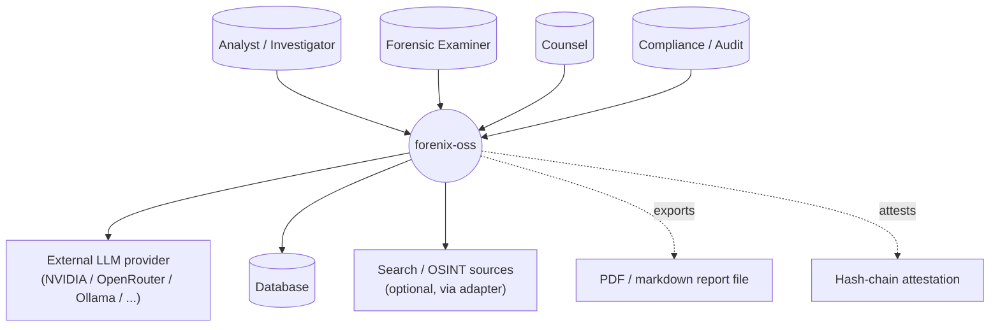
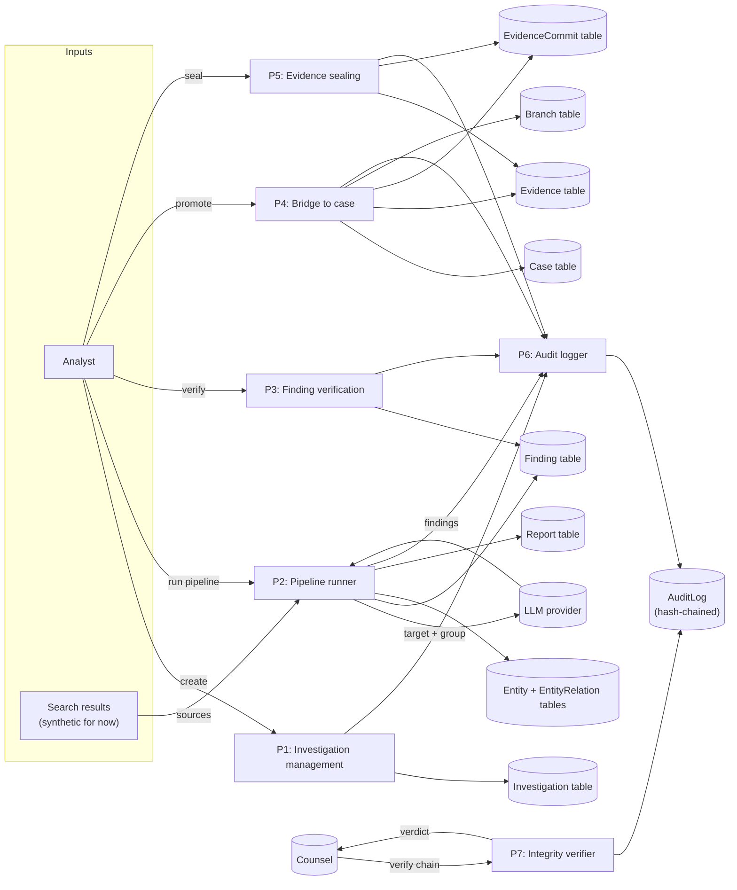
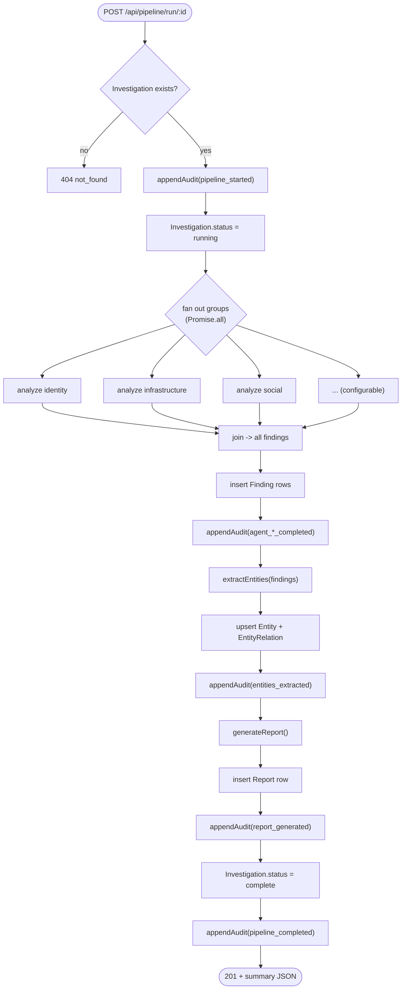
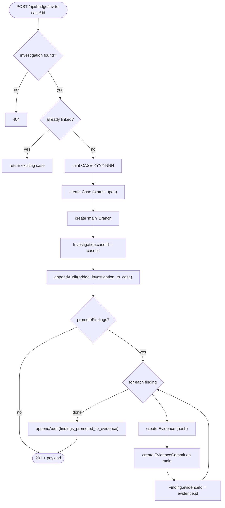
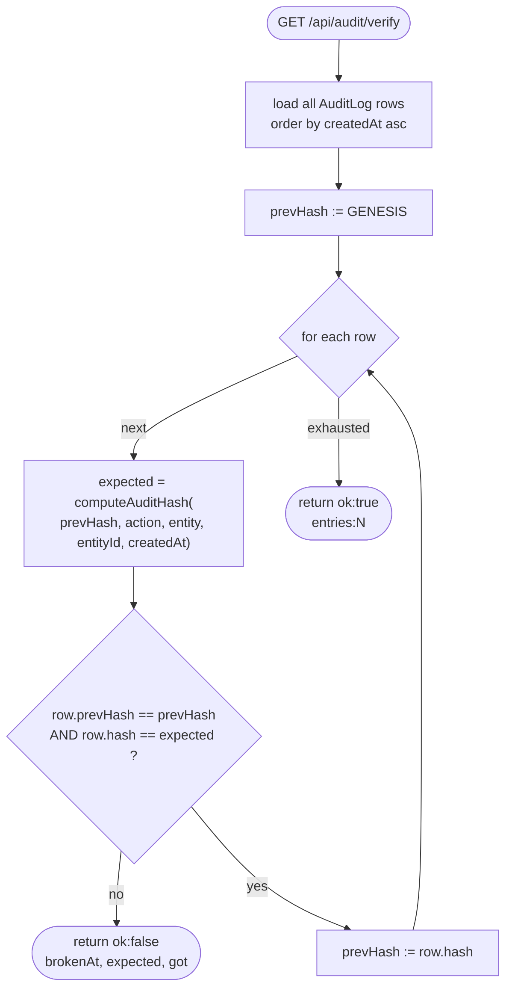
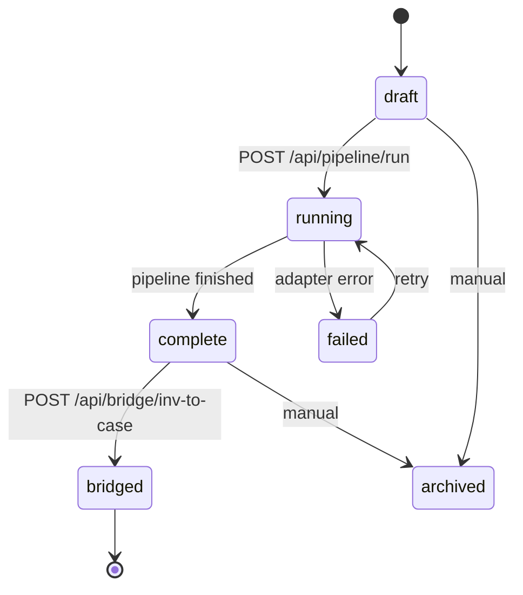
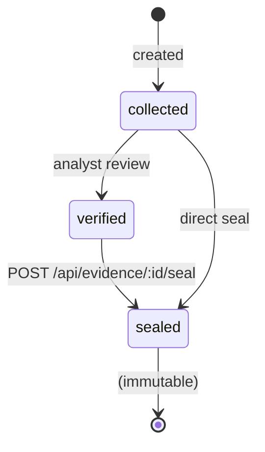
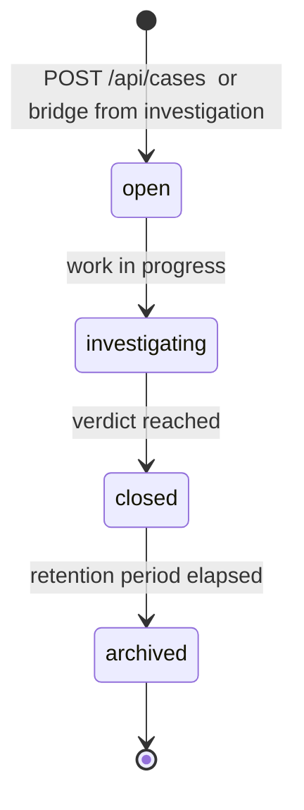

# Data Flow Diagrams  -  forenix-oss

All diagrams use Mermaid so they render directly on GitHub and in
any markdown viewer.

## Level 0  -  Context diagram



## Level 1  -  Major processes



## Level 2  -  Pipeline runner detail



## Level 2  -  Investigation -> Case bridge



## Level 2  -  Audit chain verification



## State diagram  -  Investigation



## State diagram  -  Evidence



## State diagram  -  Case



## Trust boundary

```mermaid
flowchart LR
  subgraph trusted["Trusted (server)"]
    DB[(Database)]
    Routes[Route handlers]
    Audit["audit hash chain"]
    Adapter["AI adapter factory"]
  end

  subgraph untrusted["Untrusted (anything else)"]
    Browser["Client browser"]
    LLM["LLM provider"]
    Search["Search APIs"]
  end

  Browser -->|HTTPS<br/>(zod-validated)| Routes
  Routes -->|HTTPS| LLM
  Routes -->|HTTPS| Search
  Routes --> Audit
  Audit --> DB
  Routes --> DB
```

Every cross-boundary edge is validated: incoming requests through
Zod, outbound model responses through the parsers in
`chat-completions.ts` (length caps, enum clamps, JSON-fence
extraction).
