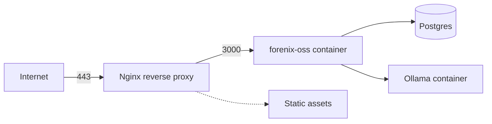
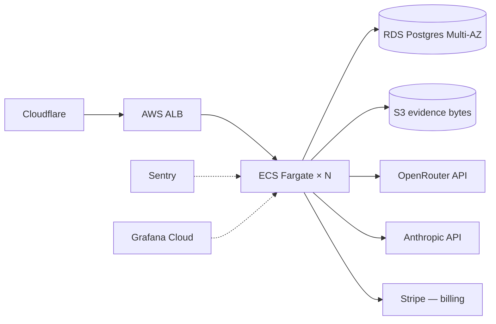

# Deployment Plan — forenix-oss

This document describes every supported deployment topology, from
laptop-only demo to production multi-region.

## 1. Topology matrix

| Topology | Audience | Runtime | DB | LLM |
|---|---|---|---|---|
| **A. Laptop demo** | engineer, evaluator | `bun run dev` | sqlite | mock |
| **B. Single-VM self-host** | solo investigator, OSS user | Docker compose | sqlite/postgres | ollama (local) or openrouter/nvidia (hosted) |
| **C. Small team on-prem** | 3-10 analysts | Docker compose + Nginx | postgres | ollama or NIM |
| **D. SaaS (forenix-oss.com)** | premium | Kubernetes | postgres + RDS | claude (paid) + openrouter |
| **E. Air-gapped** | gov / regulated | Docker compose offline | postgres | ollama only |

## 2. Topology A — Laptop demo

```bash
git clone https://github.com/thunderstornX/forenix-oss
cd forenix-oss
bun install
cp .env.example .env
bun run db:push
bun run db:seed
bun run dev
```

Opens at http://localhost:3000 with the `mock` adapter and a
9-row hash-chained audit log.

## 3. Topology B — Single VM (Docker)

```yaml
# docker-compose.yml (planned, ships in Phase 8)
services:
  forenix-oss:
    image: ghcr.io/thunderstornx/forenix-oss:latest
    restart: unless-stopped
    ports: ["3000:3000"]
    env_file: .env
    volumes:
      - ./data:/app/data
  postgres:
    image: postgres:16-alpine
    restart: unless-stopped
    environment:
      POSTGRES_DB: forenix
      POSTGRES_USER: forenix
      POSTGRES_PASSWORD_FILE: /run/secrets/postgres_password
    secrets: [postgres_password]
    volumes:
      - pg-data:/var/lib/postgresql/data
volumes:
  pg-data:
secrets:
  postgres_password:
    file: ./secrets/postgres_password
```

Minimum host: 2 vCPU / 4 GB RAM / 20 GB disk. Add 8 GB if you run
Ollama on the same box.

## 4. Topology C — Small team with Nginx



- TLS terminated at Nginx (Let's Encrypt via certbot).
- Postgres on a separate volume, daily snapshots.
- Ollama runs `qwen2.5:7b-instruct` on a 16 GB RAM box; pull once
  with `ollama pull qwen2.5:7b-instruct`.
- Backups: `pg_dump` daily + `tar`-the-data-volume weekly.

## 5. Topology D — SaaS



- Stateless app containers, 2 vCPU / 4 GB each, autoscaled.
- RDS Postgres with PITR.
- Evidence bytes in S3 (Phase 8 storage); referenced from the
  `Evidence` row by `s3://bucket/<hash>` + `metadata`.
- Stripe billing gated by `SAAS_MODE=true`.
- Sentry for errors, Grafana Cloud for traces/metrics.

## 6. Topology E — Air-gapped

- Build the container image on an internet-connected box; copy as
  a `.tar` to the air-gapped network.
- Pull Ollama models on the connected box, copy the `.ollama`
  directory across.
- Set `AI_ADAPTER=ollama` and disable any hosted-provider env
  variables.
- Disable outbound DNS at the host firewall to enforce isolation.

## 7. Environment variables

| Name | Required | Default | Notes |
|---|---|---|---|
| `DATABASE_URL` | ✅ | — | `file:./dev.db` or `postgresql://…` |
| `AI_ADAPTER` | ⚪ | `mock` | `mock` / `ollama` / `glm` / `claude` / `openrouter` / `nvidia` |
| `SAAS_MODE` | ⚪ | `false` | `true` unlocks ClaudeAdapter + premium features |
| `OPENROUTER_API_KEY` | when `AI_ADAPTER=openrouter` | — | https://openrouter.ai |
| `OPENROUTER_MODEL` | ⚪ | `deepseek/deepseek-chat` | any model on OpenRouter |
| `OPENROUTER_REFERER` | ⚪ | repo URL | OpenRouter wants this for analytics |
| `OPENROUTER_TITLE` | ⚪ | `forenix-oss` | shows in OpenRouter dashboard |
| `NVIDIA_API_KEY` | when `AI_ADAPTER=nvidia` | — | https://build.nvidia.com |
| `NVIDIA_MODEL` | ⚪ | `meta/llama-3.1-70b-instruct` | any NIM model |
| `ANTHROPIC_API_KEY` | when `AI_ADAPTER=claude` | — | https://console.anthropic.com |
| `OLLAMA_HOST` | ⚪ | `http://localhost:11434` | local Ollama URL |
| `OLLAMA_MODEL` | ⚪ | `qwen2.5:7b-instruct` | tag of any pulled model |
| `ZHIPU_API_KEY` | when `AI_ADAPTER=glm` | — | https://open.bigmodel.cn |

## 8. Migration plan (SQLite → Postgres)

1. Set `DATABASE_URL="postgresql://..."` in `.env`.
2. `bun prisma migrate dev --name init` — generates the migration.
3. `bun prisma db push` if you prefer the schema-sync path.
4. Re-seed: `bun run db:seed`.
5. If migrating an existing SQLite DB, dump + replay through
   `sqlite3 dev.db .dump | psql $DATABASE_URL` after light
   massaging (replace `BLOB` types as needed).

## 9. Day-2 operations

### 9.1 Health probe

```
GET /api/health → { status, adapter, version, saasMode }
```

Wire it into your liveness / readiness checks.

### 9.2 Audit-chain attestation

```
GET /api/audit/verify
```

Run this on a cron (every hour); page on a non-`ok` response.

### 9.3 Backups

- **Postgres:** `pg_dump --format=c` daily; PITR via WAL archival.
- **SQLite:** `sqlite3 dev.db ".backup snapshot.db"` daily.
- **S3 evidence bytes (Phase 8):** server-side versioning + object
  lock for sealed evidence.

### 9.4 Upgrade path

```
docker compose pull
docker compose up -d
bunx prisma migrate deploy   # if there are migrations
```

Audit chain survives migrations because the chain is computed over
*content*, not row order in storage.

## 10. Disaster-recovery objectives

| Metric | Target |
|---|---|
| RPO (data loss window) | ≤ 5 min via WAL streaming |
| RTO (recovery time) | ≤ 60 min on the SaaS tier |
| Chain integrity proof | always recoverable from the audit table alone |

## 11. Observability

| Signal | Where |
|---|---|
| Errors | Sentry / Logflare (planned wiring) |
| Request traces | OpenTelemetry exporter (planned) |
| Adapter call latency | logged from `chat-completions.ts` (planned) |
| Audit chain length | exposed by `GET /api/audit/verify`'s `entries` |
| Database health | Prisma metrics + Postgres pg_stat_activity |

## 12. Security posture

- Secrets only via env, never committed.
- `server-only` marker on every server-only module.
- Zod-validated POST/PUT bodies.
- HTTPS-only in production (Cloudflare + ALB terminate TLS).
- `SAAS_MODE=true` gates billing/org logic so OSS deployments
  never touch payment code paths.
- Audit chain is the single source of truth for "what happened
  when, in what order" — restore it before restoring evidence.
