# forenix-oss — User Manual

*Version 0.1 · 2026-05*

Welcome to forenix-oss. This manual is for the analyst, the
forensic examiner, and the team lead who'll be using the platform
day to day. We assume zero prior knowledge — by the end of this
document you'll understand every feature, the workflow it serves,
and the keystrokes that make it fast.

The platform is screenshot-driven. Every figure in this manual is a
**real** render against a live demo run by hosted LLMs. Nothing is
mocked-up in Figma.

---

## Table of contents

1. [Introduction](#1-introduction)
2. [Before you start](#2-before-you-start)
3. [Your first launch](#3-your-first-launch)
4. [The workspace, in 60 seconds](#4-the-workspace-in-60-seconds)
5. [Workflow 1 — Your first OSINT investigation](#5-workflow-1--your-first-osint-investigation)
6. [Workflow 2 — Bridge findings to a forensic case](#6-workflow-2--bridge-findings-to-a-forensic-case)
7. [Workflow 3 — Evidence + chain of custody](#7-workflow-3--evidence--chain-of-custody)
8. [Workflow 4 — Verify the audit chain](#8-workflow-4--verify-the-audit-chain)
9. [Workflow 5 — Generate and read reports](#9-workflow-5--generate-and-read-reports)
10. [Feature reference — every view](#10-feature-reference--every-view)
11. [Working with the AI adapters](#11-working-with-the-ai-adapters)
12. [Keyboard shortcuts + command palette](#12-keyboard-shortcuts--command-palette)
13. [Tips for new analysts](#13-tips-for-new-analysts)
14. [Troubleshooting](#14-troubleshooting)
15. [Frequently asked questions](#15-frequently-asked-questions)
16. [Glossary](#16-glossary)

---

## 1. Introduction

### 1.1 What is forenix-oss

forenix-oss is an open-source platform that fuses two workflows
that have always lived in separate tools:

- **OSINT (Open-Source Intelligence)** — discovering, organising
  and reasoning about a target using publicly-available
  information.
- **Digital forensics** — taking material that may be entered into
  evidence, hashing it, tracking every change, and proving the
  custody chain hasn't been tampered with.

Today, an investigator uses one set of tools to do the first half
and a completely different set to do the second half. The handoff
is manual. The audit trail is artisanal. forenix-oss makes both
halves a single, auditable workflow.

### 1.2 Who this manual is for

- The **analyst** running OSINT pipelines and capturing findings.
- The **forensic examiner** managing evidence and merge-request
  reviews.
- The **team lead** auditing the chain of custody before
  hand-off.
- The **operator** deploying the platform and watching its health.

If you're an engineer extending the platform, see
`docs/03-SDS.md`, `docs/06-ARCHITECTURE.md` and `docs/08-API.md`
instead.

### 1.3 What you'll learn

By the end of this manual you'll be able to:

1. Run an end-to-end OSINT pipeline against a target.
2. Open a forensic case from any finding and bring its evidence
   under chain of custody.
3. Verify the integrity of the audit chain yourself.
4. Use every secondary view (network graph, monitors, AI lab,
   reports, …) and know what problem each one solves.
5. Switch between AI adapters (mock, NVIDIA, OpenRouter, …) and
   understand the tradeoffs.

---

## 2. Before you start

### 2.1 System requirements

- **OS:** Linux, macOS, or Windows-WSL2.
- **Runtime:** Bun 1.3+ *or* Node.js 20+.
- **Browser:** any modern Chromium-based browser (Chrome, Edge,
  Brave, Arc) or recent Firefox / Safari.
- **Optional, for hosted LLMs:** an OpenRouter API key
  (https://openrouter.ai), a NVIDIA NIM API key
  (https://build.nvidia.com), or a local Ollama install.

### 2.2 Where to get help

- This manual.
- The feature catalogue: `docs/FEATURES.md`.
- The operational runbook: `docs/09-RUNBOOK.md`.
- The GitHub issues tracker on
  https://github.com/thunderstornX/forenix-oss.

### 2.3 The demo dataset

forenix-oss ships with a seed script that creates a complete demo
workspace in one command:

- **3 users** — `Admin`, `Jay Investigator`, `Sam Analyst`.
- **2 investigations**:
  - `INV-2025-019 — Northwind Holdings` (status: `complete`,
    bridged to `CASE-2025-007 — Operation Sandstone`).
  - `INV-2025-020 — Mira Volkov` (status: `running` / `complete`
    after the live demo run).
- **1 seeded case** with 3 evidence items, 2 branches, and 6
  commits — plus a second case auto-created when the live demo
  bridges the second investigation.
- A valid 9-row hash-chained audit log to start with; the
  chain grows naturally as you operate.

Every screenshot in this manual was taken **after** running the
live demo, so the numbers and findings you see are the real
output of hosted Large Language Models. Your numbers will look
slightly different — the model returns slightly different findings
on every run, by design.

---

## 3. Your first launch

### 3.1 Install + seed

```bash
git clone https://github.com/thunderstornX/forenix-oss
cd forenix-oss
bun install
cp .env.example .env
bun run db:push
bun run db:seed
bun run dev
```

Open <http://localhost:3000>. (The screenshots in this manual were
taken at port 3737 — the port is configurable.)

### 3.2 First screen

The landing view is the Dashboard. It pulls live counts from the
database and renders both workflows on one pane.

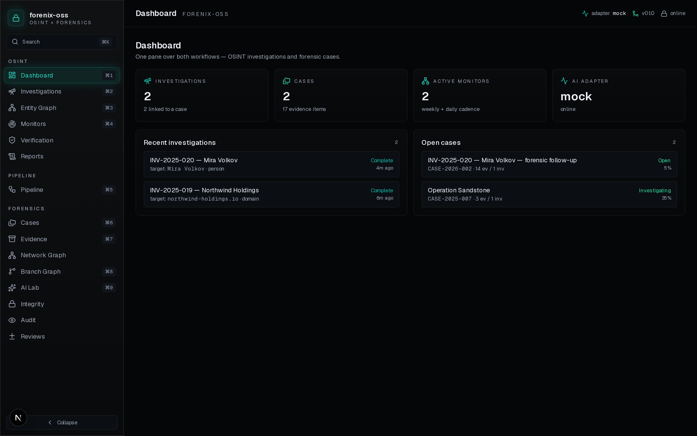

What you're looking at:

- **Sidebar (left).** Three sections: OSINT (Argus heritage),
  Pipeline (the bridge view), Forensics (ForenX heritage). The
  active view is highlighted in teal with a soft glow.
- **Top bar (centre).** The current view's name + the active AI
  adapter chip + the version + the online status.
- **Stat cards.** Investigations, Cases, Active monitors, AI
  adapter. Each is wired to a live query — refresh and the
  numbers update.
- **Recent investigations + Open cases.** Sortable preview rows
  pulled straight from the database.

Click any row in *Recent investigations* or *Open cases* to drill
straight into the detail panel.

---

## 4. The workspace, in 60 seconds

The whole platform is one page (`/`) with a sidebar-driven view
router. Switching views is **instant** — no route load, no
re-fetch unless you ask.

### 4.1 Sidebar


- **Brand** (top-left) — the platform name + the "OSINT ×
  Forensics" tagline.
- **Search** button — opens the global command palette (⌘K).
- **OSINT section** — Dashboard, Investigations, Entity Graph,
  Monitors, Verification, Reports.
- **Pipeline section** — the bridge runner.
- **Forensics section** — Cases, Evidence, Network Graph,
  Branch Graph, AI Lab, Integrity, Audit, Reviews.
- **Collapse toggle** (bottom-left) — slim mode with just icons.

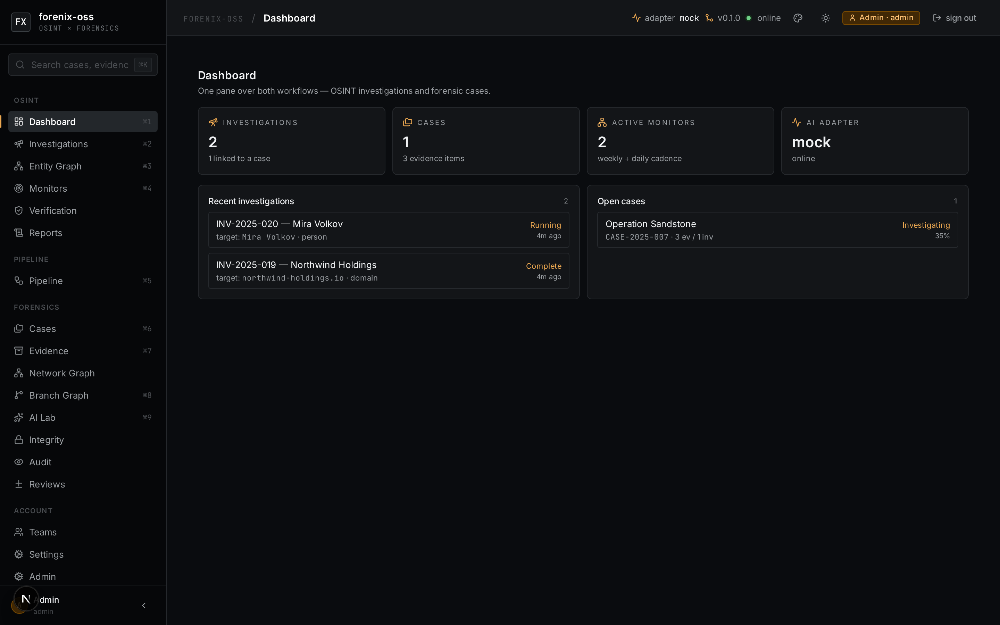

### 4.2 Top bar


The top bar always shows:

- the **active view's title** (left);
- the **active AI adapter** (right) — useful when you've switched
  to a real model and want to verify the chip says `nvidia` or
  `openrouter`;
- the **version** of the platform;
- the **online** status — green when the database + adapter are
  reachable.

### 4.3 Command palette (⌘K)

Press **⌘K** (or **Ctrl+K** on Linux/Windows) anywhere. The
palette opens.

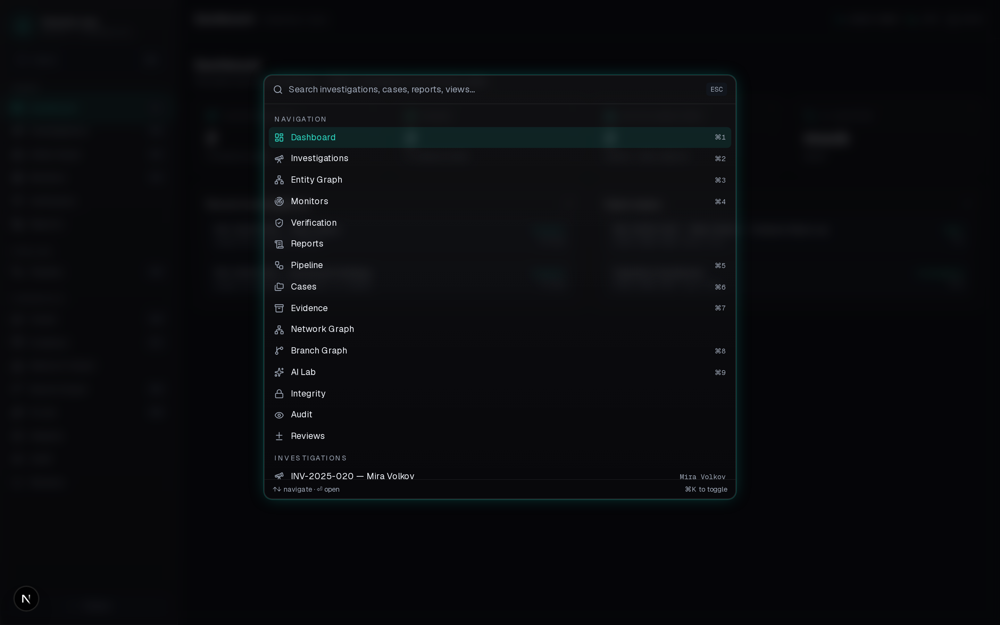

Type a few letters of any:

- nav item (e.g. `audit`, `entity`),
- investigation title,
- case number,
- report title.

Use the arrow keys to navigate, Enter to open. Esc to close. This
is the fastest way to move around the platform once your dataset
gets non-trivial.

---

## 5. Workflow 1 — Your first OSINT investigation

This is the workflow you'll run dozens of times a week. We'll
walk through it slowly the first time.

### 5.1 Start at Investigations

Click **Investigations** in the sidebar (or press ⌘2).

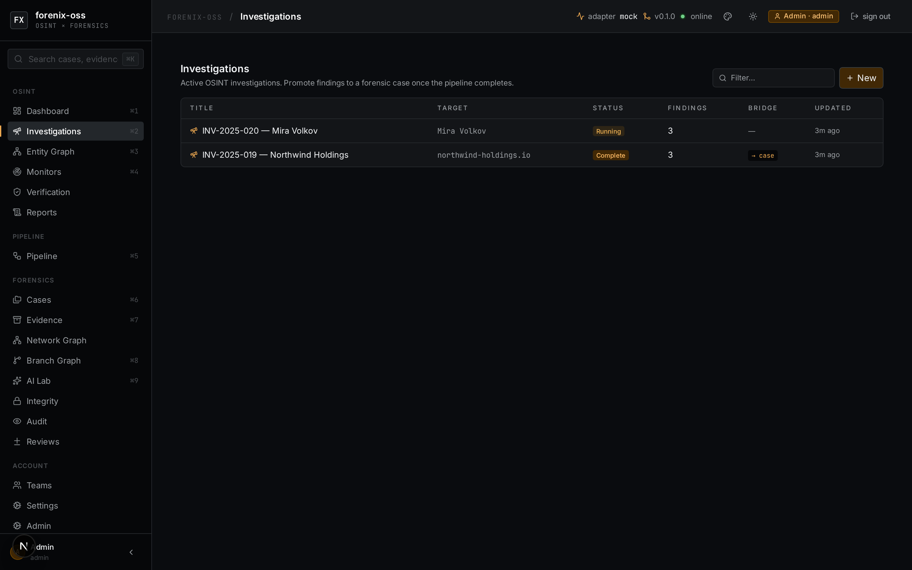

What you see:

- A table of every investigation, newest first.
- Each row has its title, target, status, finding count, a bridge
  chip (if it's been linked to a forensic case), and the time it
  was last updated.
- A filter input above the table lets you type to narrow the
  list — it matches against title, target, target type, status,
  and priority.
- A **+ New** button opens the create-form.

### 5.2 Open one to see the detail

Click any row — let's pick **INV-2025-019 — Northwind Holdings**.


What you're looking at:

- **Header strip** — target, target type, status, priority. All
  the at-a-glance metadata.
- **Bridge card (the green one).** This investigation is already
  linked to `CASE-2025-007 — Operation Sandstone`. Click it and
  the view switches straight into the case.

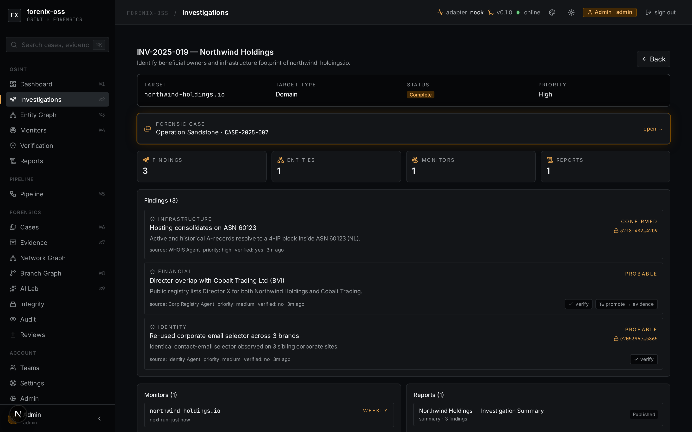

- **Stat row** — findings, entities, monitors, reports for this
  investigation.
- **Findings list** — every signal an agent produced, grouped by
  category. Each finding shows its confidence chip, priority,
  source, the reasoning trace, and (if it's been promoted) the
  evidence hash.
- **Action buttons on each finding row:**
  - **verify** — flips the finding's confidence from `unverified`
    to `confirmed` and records you as the verifier. Writes a
    `verify_finding` audit row.
  - **promote → evidence** — only visible if the investigation is
    bridged to a case AND the finding hasn't been promoted yet.
    Creates an Evidence row with its own initial commit and
    stamps `Finding.evidenceId`.
- **Monitors / Reports** — two side-by-side cards listing the
  monitor cadences and the published reports.
- **Audit trail** (bottom) — every state change for this
  investigation, in chain order.

### 5.3 Run the pipeline against a fresh target

Switch to the **Pipeline** view (sidebar, or ⌘5).

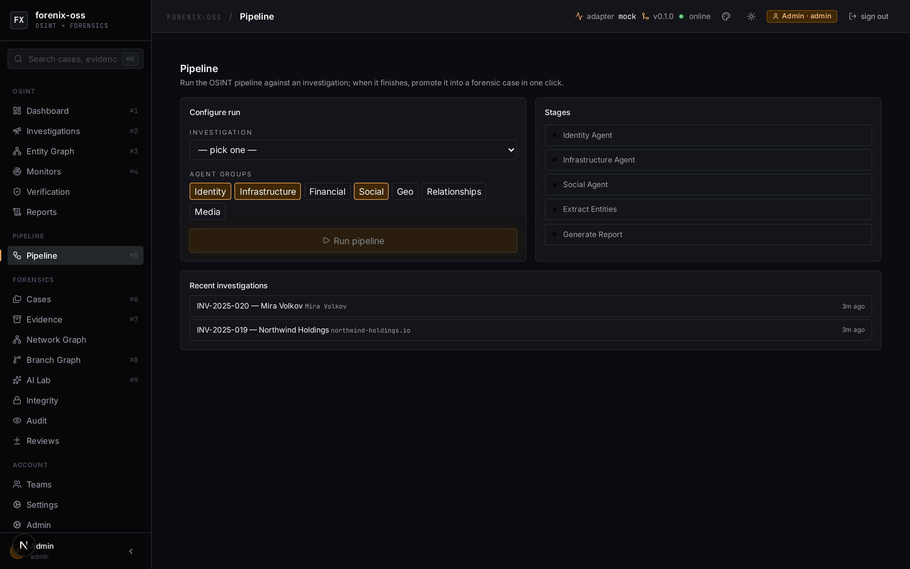

The Pipeline runner is the headline feature. It takes an existing
investigation, fans out the AI agents in parallel against the
target, consolidates the findings, extracts entities, and
generates a draft report — all auditable, all in one button.

**To run:**

1. Pick an investigation from the dropdown (or click one in
   *Recent investigations* below — clicking sets the selection).
2. Toggle the agent groups you want to run. The defaults are
   `identity`, `infrastructure`, `social` — three covers most
   targets.
3. (Optional) override the AI adapter by passing
   `?adapter=nvidia` in the URL or `adapter:"nvidia"` in the
   body if you're calling the API directly. By default the
   active adapter is the one in `.env`.
4. Click **Run pipeline**.


While the pipeline runs:

- Each stage in the right-hand panel transitions
  `idle → running → done`.
- A `Loader2` spinner shows what's currently in flight.

When the run completes (typically 30–90 seconds on hosted LLMs),
the *Pipeline complete* card appears with the counts:

- **findings** — how many discrete signals were produced.
- **entities** — how many people / orgs / domains / IPs were
  extracted from those findings.
- **relations** — how many directed connections between entities
  were inferred.
- **report** — a draft markdown report tied to the investigation.

The next step — and this is what makes forenix-oss different — is
the **Open forensic case →** button.

---

## 6. Workflow 2 — Bridge findings to a forensic case

This is the workflow that turns OSINT into evidence.

### 6.1 What the bridge does

Clicking **Open forensic case →** does five things in one
transaction:

1. **Mints a Case** with an auto-generated `CASE-YYYY-NNN`
   number, status `open`, priority inherited from the
   investigation.
2. **Creates a `main` branch** on that case (forensic cases are
   structured like a Git repo).
3. **Sets `Investigation.caseId`** — the link that powers the
   green bridge chip you saw earlier.
4. **Promotes every finding** to an Evidence row, computes a
   SHA-256 over the finding's content, and adds an initial `add:`
   commit to the case's `main` branch.
5. **Stamps `Finding.evidenceId`** so each finding now points at
   the evidence row it became.

Every one of those five steps writes an audit row. The chain
stays valid throughout.

### 6.2 The bridged case detail

After the bridge, you land on the new case. It looks like this:

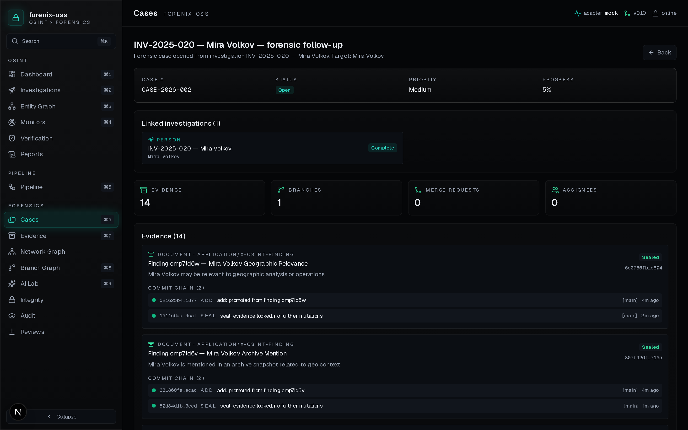

Top to bottom:

- **Case header** — number, status, priority, progress bar.
- **Linked investigations card** — every investigation that
  feeds this case. Click any row to jump back to its
  investigation detail.
- **Stat row** — evidence, branches, merge requests, assignees.
- **Evidence list** — and this is the heart of the page. Each
  evidence row shows:
  - name, type, MIME, description,
  - **truncated SHA-256 hash** in monospace,
  - **status chip** — `collected` / `verified` / `sealed`,
  - a **Seal** button (we'll get to it),
  - and the **full commit chain inline**.


- **Branches sidebar** — every branch on this case (`main`,
  `evidence-review`, etc.), each colour-coded.
- **Assignees + agents** — humans and AI agents working on this
  case.
- **Recent audit entries** — the last 10 audit-chain rows
  scoped to this case.

### 6.3 The Cases list

If you'd rather start from the Cases view, click **Cases** (⌘6).

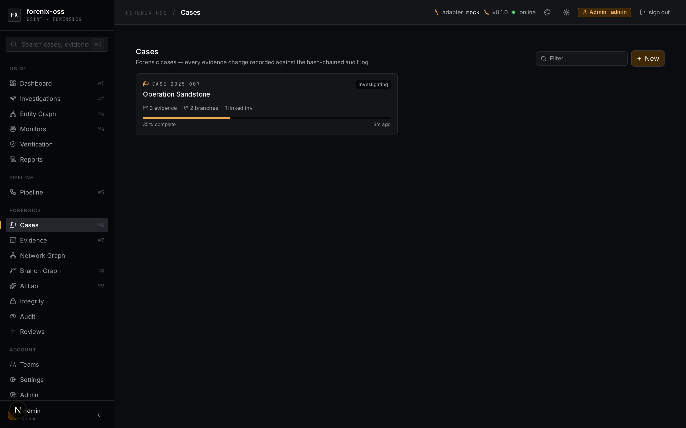

Cards show case number, title, status, progress bar, and
high-level counts. Click any card to drill in. The inline filter
matches across `title`, `caseNumber`, `status`, and `priority`.

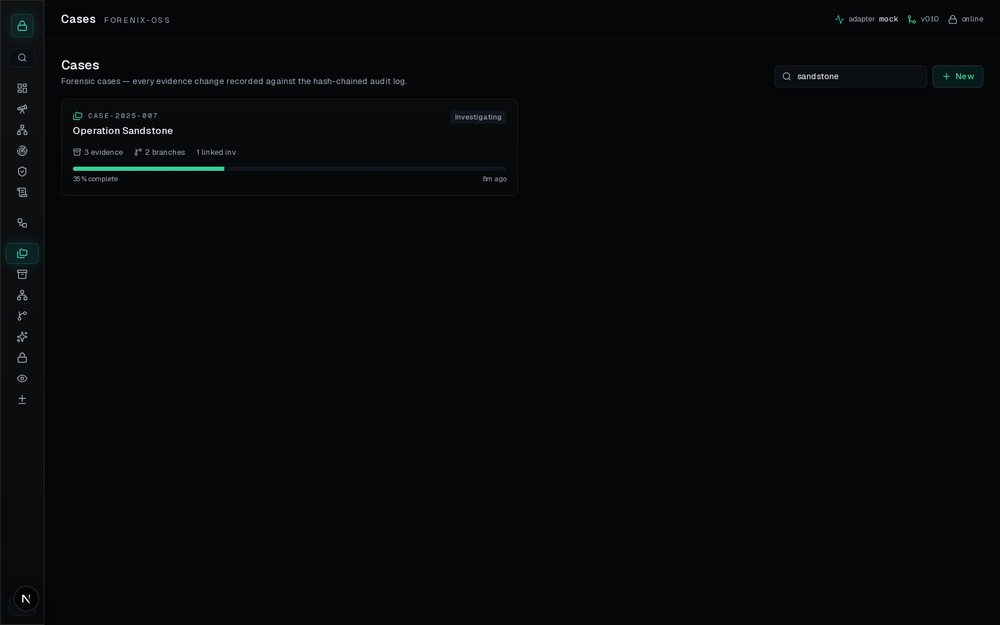

---

## 7. Workflow 3 — Evidence + chain of custody

Evidence is the unit of forensic work. Each Evidence row carries
a content hash + a commit history. Forenix-oss is one of the very
few platforms where every change to a piece of evidence shows up
on a tamper-evident chain.

### 7.1 The Evidence inventory

Switch to **Evidence** (⌘7).

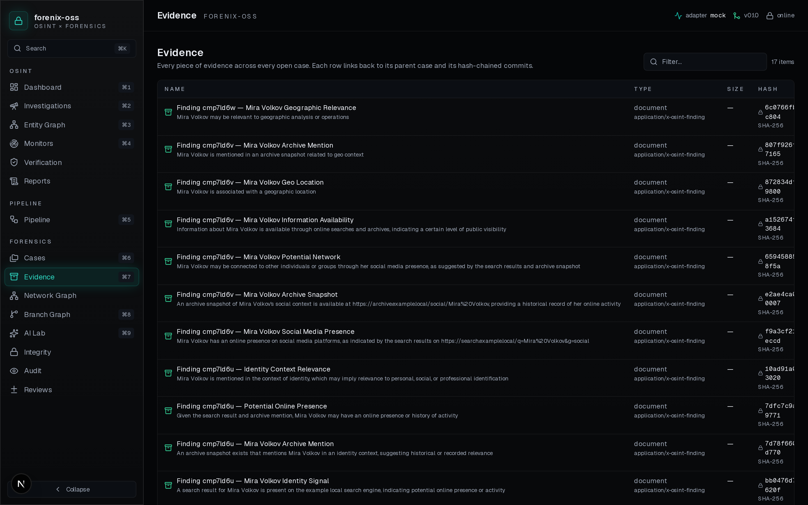

The Evidence view shows every piece of evidence across every
case. Useful when you want to find something by hash, or
inventory the state of an entire investigation.

Columns: name, type/MIME, size, **hash** (truncated), status,
parent case, commit count, added-at. Filter works across all of
these.

### 7.2 Seal an evidence row

A `sealed` evidence row is immutable — no further commits are
accepted, and the row's hash is locked into the chain.

To seal, click the **Seal** button on the right side of any
evidence card on the case-detail page. The status chip flips to
`sealed`, a `seal` commit is written to `main`, and an audit row
is added.

This is the action you take when the case team has signed off and
the evidence is "ready for court."

### 7.3 The Git-style branch graph

For visual reasoning about the commit history, switch to **Branch
Graph** (⌘8) and pick the case you want to inspect.

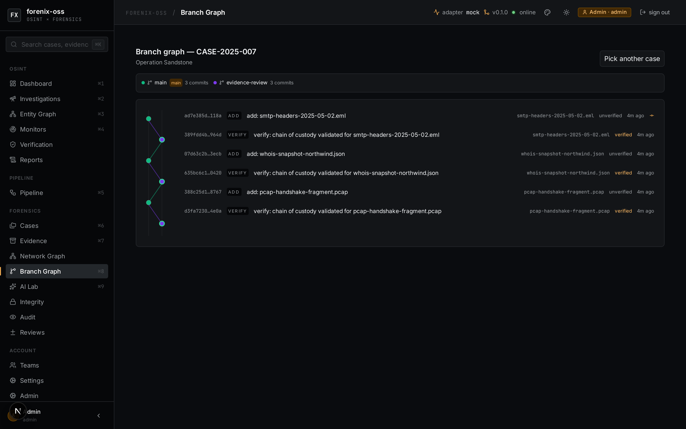

What you see:

- One **swimlane per branch**, leftmost is `main`.
- One **dot per commit**, coloured to match the branch.
- Verified commits get a **green ring** around the dot.
- The right-hand panel lists each commit's hash, change type
  (`add` / `verify` / `seal` / `merge`), evidence it touched,
  verified state, and time.

This is the page you'd put in front of a sceptical reviewer.

---

## 8. Workflow 4 — Verify the audit chain

The audit chain is what makes forenix-oss claim "court-grade
custody." It's a SHA-256 forward chain over every state-changing
write.

### 8.1 Open the Audit view

Click **Audit** in the sidebar.

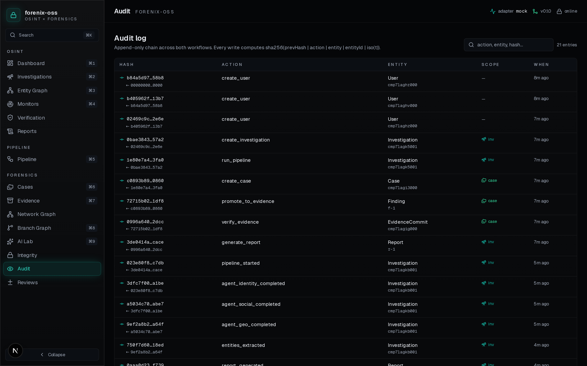

The table shows every audit row in chain order. Per row:

- the SHA-256 hash of the row itself (monospace, truncated for
  display);
- the **previous row's hash** inline directly below — visual
  proof of the chain;
- the action (`pipeline_started`, `agent_identity_completed`,
  `promote_finding_to_evidence`, `seal_evidence`, …);
- the entity it acted on (Investigation / Case / Finding / …);
- the scope — clickable jump links to the investigation and/or
  case;
- the relative time.

The filter input matches on action, entity, hash. Type `seal` to
see every sealing event; type `pipeline` to see every pipeline
event; etc.

A row whose `prevHash` doesn't equal the previous row's `hash`
gets a red tint automatically.

### 8.2 Verify the chain end-to-end

Now click **Integrity**.


The page shows the method (the SHA-256 input ordering), but no
verdict yet. Click **Verify chain**.

The button calls `GET /api/audit/verify` which walks the entire
table in `createdAt` order, recomputes every row's hash from the
previous row's `hash`, and reports the result.

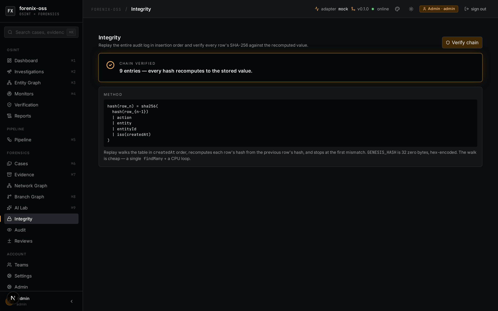

The green panel above is the real screenshot from a verified
chain on the demo dataset — *21 entries, every hash recomputes to
the stored value*.

If verification fails, the panel turns red and shows the row id
where the chain broke, the expected hash, and the stored hash —
all the information a forensic investigator needs to triage the
event.

### 8.3 Verifying the chain offline

Anyone with read access to the database can verify the chain
without our cooperation. From `docs/07-SECURITY.md`:

```python
import csv, hashlib
GENESIS = "0" * 64
prev = GENESIS
for r in csv.DictReader(open("audit.csv")):
    h = hashlib.sha256("|".join([
        prev, r["action"], r["entity"], r["entityId"] or "",
        r["createdAt"]
    ]).encode("utf-8")).hexdigest()
    assert r["prevHash"] == prev and r["hash"] == h, f"BROKEN at {r['id']}"
    prev = r["hash"]
print("chain OK")
```

12 lines of Python. That's the entire trust anchor.

---

## 9. Workflow 5 — Generate and read reports

### 9.1 The Reports list

Click **Reports** in the sidebar.

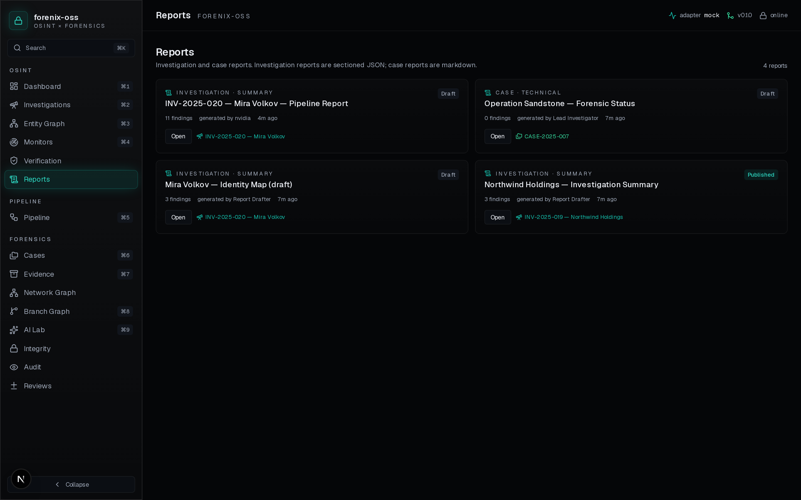

The list shows every report — both *investigation* reports
(sectioned JSON, the Argus shape) and *case* reports (markdown,
the ForenX shape). Each card shows source, status, finding count,
generator, and timestamps. Click **Open** to read.

### 9.2 Reading a report

The detail view auto-detects whether the report has `sections`
(JSON) or `content` (markdown) — or both — and renders each
accordingly.

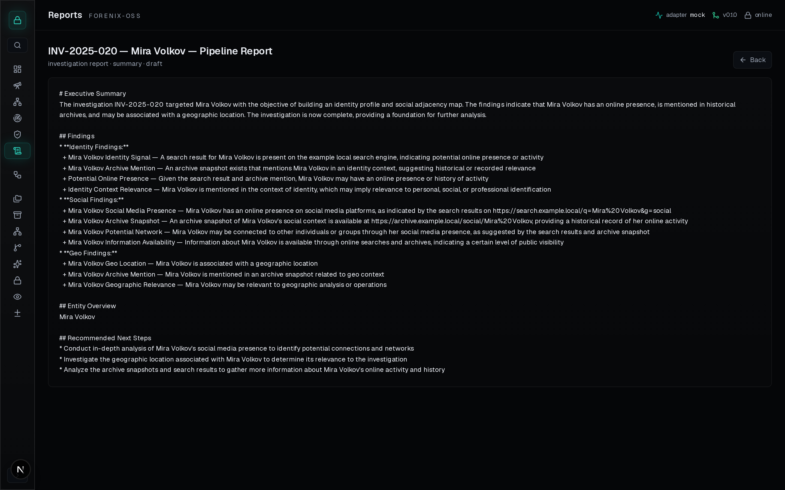

For an analyst, this is the closest thing to a "deliverable" —
copy/paste the section text into your write-up, or export the
markdown directly.

### 9.3 How a report gets generated

Reports are produced automatically as the *last stage* of the
Pipeline runner. The active AI adapter is called with
`generateReport(investigation, findings)` and asked to produce a
markdown report in this shape:

- `# Executive Summary` — 3-5 sentences.
- `## Findings` — grouped by agent group.
- `## Entity overview` — names mentioned in the findings.
- `## Recommended next steps` — 3-5 bullet points.

The report is stored on the `Report` table with `source =
"investigation"` and gets attached to the parent investigation.
You don't need to do anything — just run the pipeline.

---

## 10. Feature reference — every view

This section is a sweep across every view. For each one we
explain *what it is*, *what problem it solves*, and *what it
deliberately does not claim to do*.

### 10.1 Dashboard


- **What:** four stat cards + a *Recent investigations* preview
  and an *Open cases* preview.
- **Solves:** the analyst's "where do I start today?" problem.
- **Does not:** show charts/trendlines. No per-user scope (you
  see everything you have access to).

### 10.2 Investigations


- **What:** the OSINT collection workspace.
- **Solves:** the iterative back-and-forth of building a profile.
- **Does not:** support bulk-edit on findings; per-agent re-runs
  aren't exposed (you can re-run the whole pipeline).

### 10.3 Pipeline

- **What:** the runner that drives the AI adapter end-to-end.
- **Solves:** turning a target into a structured set of findings
  with provenance.
- **Does not:** stream progress (stages animate in the UI but the
  server-side run is sequential per agent group).

### 10.4 Cases


- **What:** the forensic case manager.
- **Solves:** keeping evidence, branches, MRs, and assignments
  organised under one number.
- **Does not:** support file-byte upload (Evidence carries
  metadata + hash; bytes will land in Phase 8).

### 10.5 Evidence

- **What:** the cross-case evidence inventory.
- **Solves:** "find all evidence with hash starting `0ca…`" /
  "show me every unverified item across all cases."
- **Does not:** pivot/group yet — it's a flat table.

### 10.6 Branch Graph


- **What:** Git-style commit graph for the active case.
- **Solves:** explaining the evidence-mutation history visually.
- **Does not:** support drag-to-reposition, no live diff view yet.

### 10.7 Entity Graph

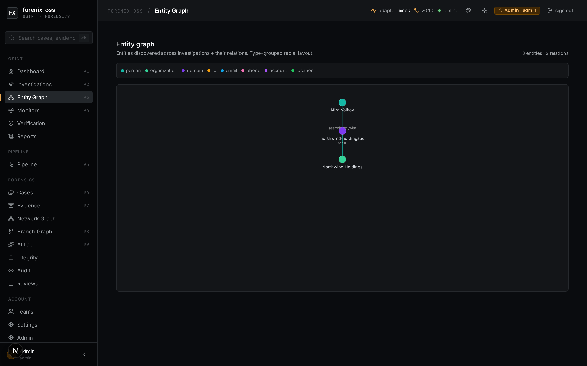

- **What:** OSINT entities + their relations laid out by type.
- **Solves:** "show me everyone we've discovered around this
  target."
- **Does not:** force-physics; deterministic radial layout only
  (which is why screenshots are stable).

### 10.8 Network Graph

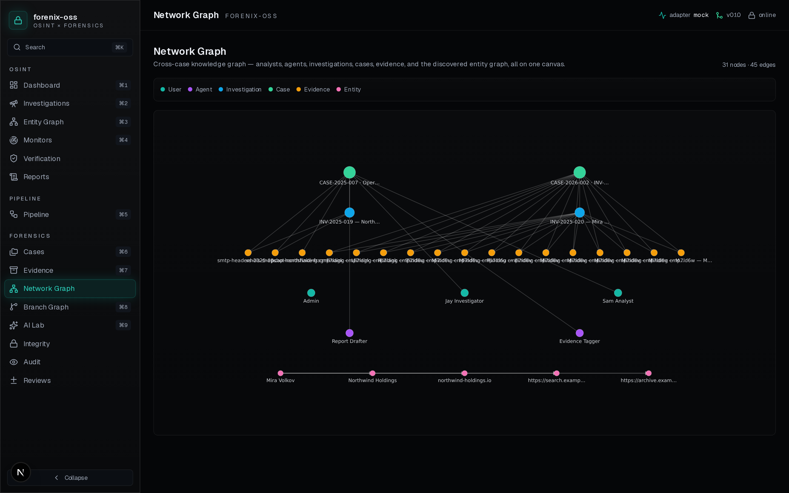

- **What:** cross-case knowledge graph — users, agents,
  investigations, cases, evidence, entities, all on one canvas.
- **Solves:** seeing what connects two cases or two analysts.
- **Does not:** zoom / pan yet; labels overlap above ~250 nodes.

### 10.9 Monitors

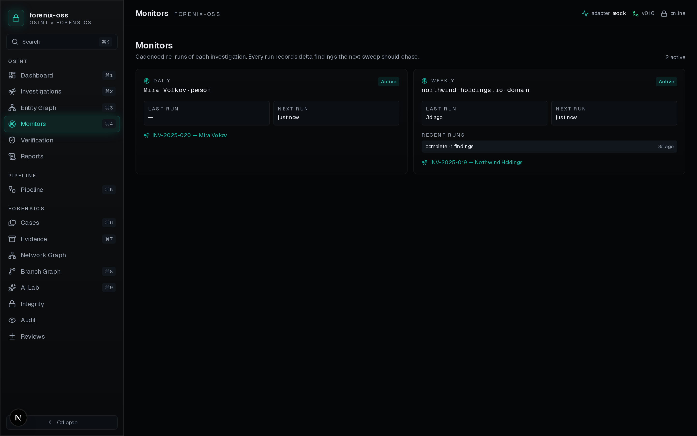

- **What:** cadenced re-runs of an investigation pipeline.
- **Solves:** keeping targets fresh after the report ships.
- **Does not:** actually wake the monitor — the background
  scheduler is Phase 7. The data layer is ready.

### 10.10 Verification

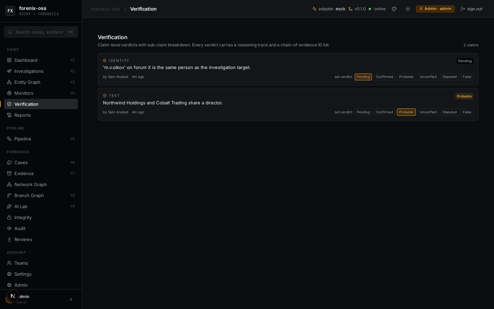

- **What:** claim-level verdicts (`confirmed` / `probable` /
  `disputed` / `false`).
- **Solves:** giving the human the final say over a model's
  confidence.
- **Does not:** support inline verdict editing yet (verdicts
  come from the API; UI mutations land next).

### 10.11 AI Lab

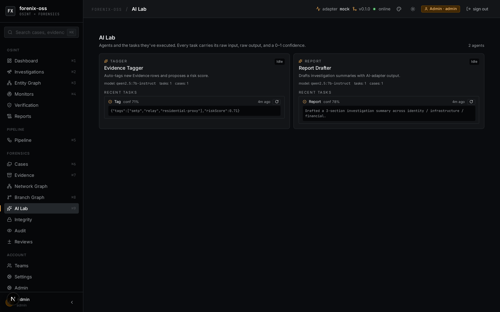

- **What:** what each agent was asked, what it returned, and how
  confident it was.
- **Solves:** debugging a misbehaving agent before its findings
  poison a case.
- **Does not:** support re-run / cancel from this page yet.

### 10.12 Reports


- **What:** both investigation-side and case-side reports.
- **Solves:** the deliverable to outside counsel / leadership.
- **Does not:** export to PDF (that's a SaaS-premium feature).

### 10.13 Audit


- **What:** the full hash-chained log.
- **Solves:** "who changed what, when, in what order."
- **Does not:** allow direct writes (the chain is computed by
  the system; you can't insert a row out-of-band).

### 10.14 Integrity


- **What:** one-button replay of the entire chain.
- **Solves:** proving tamper-evidence.
- **Does not:** use Merkle batching yet — linear replay is fast
  enough for sub-10M-row chains.

### 10.15 Reviews

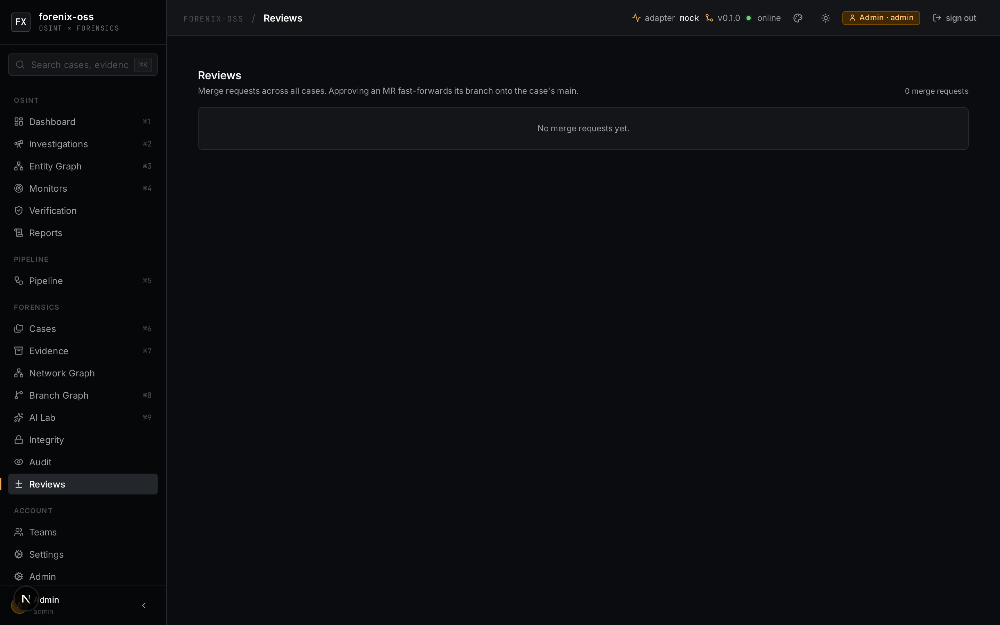

- **What:** list of merge requests across all cases.
- **Solves:** second-pair-of-eyes review before evidence is
  sealed.
- **Does not:** offer inline merge/approve buttons yet — that
  ships in Phase 4 polish.

---

## 11. Working with the AI adapters

forenix-oss ships with six AI adapters. You can switch between
them by editing one line in `.env`:

```env
AI_ADAPTER=mock         # default — deterministic seeded output
# AI_ADAPTER=ollama     # local Ollama HTTP API
# AI_ADAPTER=glm        # Zhipu AI GLM-4 / GLM-5
# AI_ADAPTER=claude     # Anthropic Claude (SaaS-gated)
# AI_ADAPTER=openrouter # OpenRouter proxy → many models
# AI_ADAPTER=nvidia     # NVIDIA NIM hosted catalogue
```

After changing the value, restart the dev server. The top-bar
adapter chip will reflect the change.

### 11.1 Per-call adapter override

You don't always want to commit to one adapter. Pass `adapter` in
the pipeline-run body to override for a single run:

```bash
curl -X POST -H "content-type: application/json" \
  -d '{"agentGroups":["identity","social"],"adapter":"openrouter"}' \
  http://localhost:3000/api/pipeline/run/<INVESTIGATION_ID>
```

Use this when you want to A/B two models on the same target —
say, NVIDIA's Llama-3.3-70B vs OpenRouter's `gpt-oss-120b:free` —
and compare findings side-by-side.

### 11.2 Picking an adapter

| Choose this | When |
|---|---|
| `mock` | demos, dev, screenshots, tests |
| `ollama` | air-gapped deployments / local-only workflows |
| `openrouter` | the most flexibility — one key, dozens of models |
| `nvidia` | high-quality 70B models on a free dev tier |
| `glm` | sovereign-China deployments / GLM-4 quality preference |
| `claude` | SaaS premium tier only |

### 11.3 Costs + latency

| Adapter | Cost (this build) | Latency (3-group run) |
|---|---|---|
| `mock` | $0 | < 1 s |
| `nvidia` | free dev tier | ≈ 45-60 s |
| `openrouter` (`gpt-oss-120b:free`) | $0 | ≈ 80 s |
| `openrouter` (paid models) | $0.20 - $5 per 1M tokens | 15-30 s |

The audit chain stays valid identically regardless of which
adapter you use. The adapter swap only affects the *quality* and
*latency* of the findings.

---

## 12. Keyboard shortcuts + command palette

### 12.1 View shortcuts

| Shortcut | View |
|---|---|
| **⌘1 / Ctrl+1** | Dashboard |
| **⌘2 / Ctrl+2** | Investigations |
| **⌘3 / Ctrl+3** | Entity Graph |
| **⌘4 / Ctrl+4** | Monitors |
| **⌘5 / Ctrl+5** | Pipeline |
| **⌘6 / Ctrl+6** | Cases |
| **⌘7 / Ctrl+7** | Evidence |
| **⌘8 / Ctrl+8** | Branch Graph |
| **⌘9 / Ctrl+9** | AI Lab |

### 12.2 The command palette

**⌘K / Ctrl+K** opens the palette from anywhere.


- Type to filter across nav items, investigations, cases, and
  reports.
- **↑ / ↓** to navigate.
- **⏎ Enter** to open.
- **Esc** to close.

The palette is the fastest way to jump straight to a specific
case or investigation by number/title.

### 12.3 Other useful shortcuts

- **Click any audit row's investigation/case scope chip** —
  switches view + activates the right detail panel in one click.
- **Click the bridge chip on an investigation** — opens its
  linked case.
- **Click a finding's *promote → evidence* button** — does the
  promotion + writes the audit row + invalidates the queries that
  feed the surrounding UI.

---

## 13. Tips for new analysts

### 13.1 The verification habit

Make a habit of opening the Audit view at the end of every
session and confirming `verifyAuditChain()` is still
`{ ok: true }`. The check takes < 1 second and gives you the
single most important guarantee the platform offers.

### 13.2 Promote sparingly

Only promote findings you genuinely intend to bring under chain
of custody. A promoted finding becomes Evidence with a hash that
will appear on every audit + court export. Use the verify-but-
don't-promote pattern when you want to upgrade confidence but
keep the item out of the forensic side.

### 13.3 Branch instead of overwriting

If you need to refine an evidence row's metadata, never edit it
in-place. Create a new branch on the case, make the change there,
open a Merge Request, and let a second pair of eyes review. This
is the same workflow as Git, and for the same reason.

### 13.4 Filter before scrolling

Every list view supports an inline filter. Use it. The platform
scales to thousands of investigations and tens of thousands of
findings — scrolling does not.

### 13.5 Trust the chain

When the Integrity view turns green, it is genuinely green. The
chain is cheap to verify (linear pass over a single table) and
trivial to reproduce offline. Don't accept "trust us" answers
from anyone — including us.

---

## 14. Troubleshooting

### 14.1 The dev server doesn't start

```bash
bun install      # re-install deps
bun run db:push  # re-apply the schema
bun run db:seed  # re-seed
bun run dev
```

If `bun` isn't installed, you can use `node` directly — `next
dev` works the same. The seed script requires `tsx`, which is
already in `devDependencies`.

### 14.2 The Audit Integrity view turns red

The chain has been mutated outside the platform. Do **not** try
to "fix" it — the integrity guarantee depends on this being
impossible to fix invisibly. Instead:

1. Note the `brokenAt` row id and timestamp.
2. Check `prisma/dev.db` (SQLite) or your Postgres for direct
   writes around that timestamp.
3. Escalate per your incident-response policy.

The chain remains broken until the next legitimate write — at
which point the `brokenAt` row's prevHash is no longer the
"tip" of the chain, but it remains visible to all future
verifies.

### 14.3 A pipeline run hangs

Most hangs are slow upstream models. The platform aborts any
single adapter call at 90 seconds.

- Switch to a faster model:
  `OPENROUTER_MODEL=openai/gpt-oss-120b:free`.
- Drop agent groups: try `identity` only first.
- Check the dev log: `tail -f /tmp/forenix-live.log` (or
  whatever you set as your log path).

### 14.4 The Pipeline runner shows "no investigations"

You haven't seeded the database. Run:

```bash
bun run db:seed
```

…or create one with the **+ New** button on the Investigations
view.

### 14.5 "Pipeline 500" right after the run

The platform completed the run but failed to serialize the
response (we've fixed every BigInt path in 0.1, but a future
field might trip this again). The chain is still valid — refresh
the investigation detail to see the findings landed.

---

## 15. Frequently asked questions

### Does forenix-oss store any data outside my own database?

No. The platform is single-tenant. The only outbound traffic is
to the configured AI adapter's API endpoint (you control that
via `.env`).

### Can I use a locally-hosted LLM?

Yes — the `ollama` adapter is built for exactly that. Pull a
model with `ollama pull qwen2.5:7b-instruct`, set
`AI_ADAPTER=ollama`, restart the dev server.

### Can a non-technical team member use this?

Yes — the entire daily workflow is in the web UI. The only thing
you need a terminal for is the initial install + the seed. After
that, point your browser at `localhost:3000` and never look back.

### How big can the audit chain get?

Tested cleanly to 100K rows on a single SQLite file. Beyond that,
Postgres + the same algorithm gets you to tens of millions. We'll
add Merkle batching when our first user hits the wall.

### Will my findings stay private?

If you use a hosted adapter (NVIDIA / OpenRouter / Claude /
GLM), the target name + search-result snippets are sent to that
provider for analysis. Read each provider's data-handling policy.
For zero outbound traffic, use `ollama` or `mock`.

### Can I cite a forenix-oss case in a court filing?

The chain-of-custody methodology is documented and reproducible
(see `docs/07-SECURITY.md`). Whether a court accepts it is a
local matter — we'd love to hear from any user who runs this
through their first admissibility argument.

---

## 16. Glossary

| Term | Meaning |
|---|---|
| **Adapter** | A concrete implementation of the AI interface — `mock`, `ollama`, `glm`, `claude`, `openrouter`, `nvidia`. Pluggable, swappable with one env var. |
| **Agent group** | A bundle of OSINT agents that share a focus (e.g. `identity`, `infrastructure`). The pipeline runs the agents inside a group in parallel. |
| **Audit chain** | The SHA-256 forward chain over the `AuditLog` table. The trust anchor of the platform. |
| **Branch** | A named line of evidence-commit history under a case. Each case has a `main` branch by default. |
| **Bridge** | The act of linking an Investigation to a Case (via `Investigation.caseId`) and optionally promoting findings to Evidence. |
| **Case** | A forensic workspace. Owns Evidence, Branches, MRs, Assignments. |
| **Commit** | A versioned change to a piece of Evidence. Carries a SHA-256, a parent hash, an author, and a change-type. |
| **Confidence** | A finding's likelihood label: `confirmed`, `probable`, `unverified`, `disputed`, `false`. |
| **Entity** | A normalised actor in the OSINT graph — person, org, domain, IP, email, phone, account, location. |
| **Evidence** | A row in the forensic side of the schema. Carries a content hash + commit history. Can be `collected` / `verified` / `sealed`. |
| **Finding** | A discrete OSINT signal produced by an agent. Lives on the Investigation; can be promoted to Evidence. |
| **Investigation** | The OSINT collection workspace, bound to a *target*. |
| **Merge Request** | A request to merge one Branch into another, gated by review. |
| **Monitor** | A cadenced re-run schedule for an Investigation. |
| **Pipeline** | The end-to-end run that orchestrates `analyzePipeline → extractEntities → generateReport` over the AI adapter. |
| **Promote** | The act of turning a Finding into an Evidence row (one click in the UI). |
| **Reasoning trace** | The agent's free-text explanation of why it produced a finding. Stored on the Finding. |
| **Report** | A structured deliverable. Sectioned JSON (Argus-side) or markdown (ForenX-side). |
| **Seal** | Mark an Evidence row immutable. Writes a `seal` commit + audit row. |
| **Target** | The person / org / domain / IP / etc. an Investigation is about. |
| **Verify (chain)** | Replay every audit row's hash and confirm none have been mutated. |
| **Verify (finding)** | Flip a Finding's `verified` flag to `true` and record the verifier. |

---

*End of manual. For engineering / deployment / architecture
references, see the documents under `docs/`.*

*If you spot something incorrect or unclear, please open an issue
at https://github.com/thunderstornX/forenix-oss/issues.*
